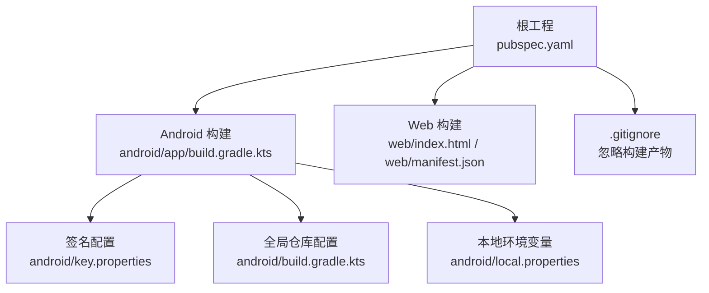
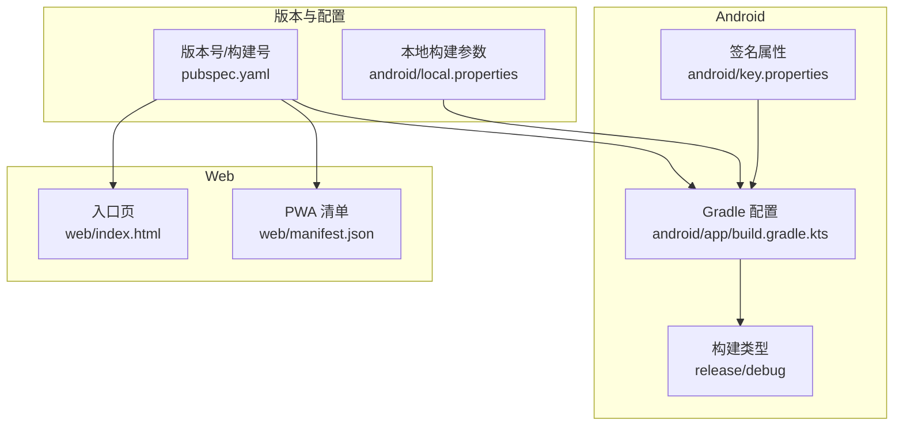
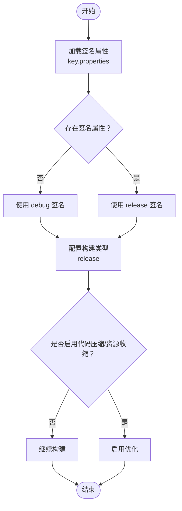
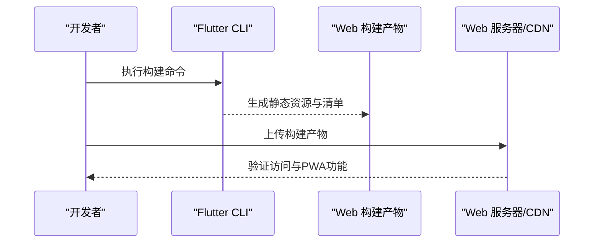
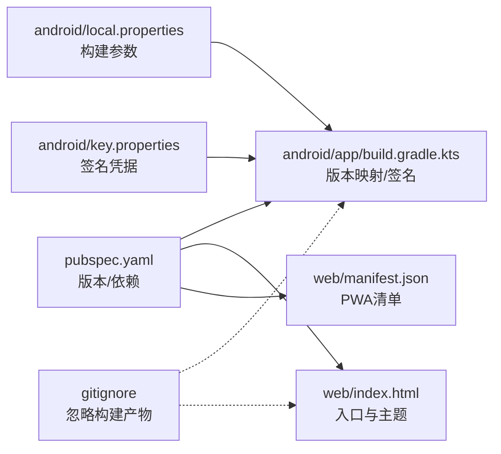

# 部署与发布

<cite>
**本文引用的文件**
- [pubspec.yaml](file://pubspec.yaml)
- [android/app/build.gradle.kts](file://android/app/build.gradle.kts)
- [android/build.gradle.kts](file://android/build.gradle.kts)
- [android/key.properties](file://android/key.properties)
- [android/create_keystore.ps1](file://android/create_keystore.ps1)
- [android/local.properties](file://android/local.properties)
- [web/index.html](file://web/index.html)
- [web/manifest.json](file://web/manifest.json)
- [.gitignore](file://.gitignore)
- [README.md](file://README.md)
</cite>

## 目录
1. [简介](#简介)
2. [项目结构](#项目结构)
3. [核心组件](#核心组件)
4. [架构总览](#架构总览)
5. [详细组件分析](#详细组件分析)
6. [依赖关系分析](#依赖关系分析)
7. [性能考虑](#性能考虑)
8. [故障排除指南](#故障排除指南)
9. [结论](#结论)
10. [附录](#附录)

## 简介
本指南面向Facebook克隆项目的部署与发布，覆盖Android APK构建与签名、iOS IPA构建与发布、Web平台部署以及通用的版本管理、发布渠道、更新机制、CI/CD流水线与发布检查清单。文档基于仓库现有配置进行梳理与扩展建议，帮助团队在不同平台上稳定地完成构建、签名、打包与发布。

## 项目结构
该仓库采用Flutter多平台工程组织方式，包含Android与Web平台的构建配置与资源文件。关键目录与职责如下：
- android：Android应用的Gradle配置、签名密钥与构建脚本
- lib：Flutter应用主逻辑（未在本文展开）
- web：Web平台入口与PWA清单
- packages：本地包（如可靠WebSocket实现）
- 根目录：Flutter工程配置、依赖声明与版本信息

图表来源
- [pubspec.yaml:1-135](file://pubspec.yaml#L1-L135)
- [android/app/build.gradle.kts:1-68](file://android/app/build.gradle.kts#L1-L68)
- [android/build.gradle.kts:1-29](file://android/build.gradle.kts#L1-L29)
- [android/key.properties:1-4](file://android/key.properties#L1-L4)
- [android/local.properties:1-5](file://android/local.properties#L1-L5)
- [web/index.html:1-239](file://web/index.html#L1-L239)
- [web/manifest.json:1-36](file://web/manifest.json#L1-L36)
- [.gitignore:1-45](file://.gitignore#L1-L45)

章节来源
- [pubspec.yaml:1-135](file://pubspec.yaml#L1-L135)
- [android/app/build.gradle.kts:1-68](file://android/app/build.gradle.kts#L1-L68)
- [android/build.gradle.kts:1-29](file://android/build.gradle.kts#L1-L29)
- [android/key.properties:1-4](file://android/key.properties#L1-L4)
- [android/local.properties:1-5](file://android/local.properties#L1-L5)
- [web/index.html:1-239](file://web/index.html#L1-L239)
- [web/manifest.json:1-36](file://web/manifest.json#L1-L36)
- [.gitignore:1-45](file://.gitignore#L1-L45)

## 核心组件
- 版本与构建参数
  - 工程版本与构建号在根配置中定义，用于Android/iOS/Web统一版本管理。
- Android构建与签名
  - Gradle配置读取签名属性文件，支持release签名；当前release类型默认使用debug签名以便快速验证。
- Web平台
  - 提供PWA清单与入口页，包含主题色、图标与启动行为配置。
- 本地环境
  - 通过local.properties设置SDK路径与Flutter构建模式、版本号等。

章节来源
- [pubspec.yaml:7-19](file://pubspec.yaml#L7-L19)
- [android/app/build.gradle.kts:11-62](file://android/app/build.gradle.kts#L11-L62)
- [web/index.html:20-38](file://web/index.html#L20-L38)
- [web/manifest.json:1-36](file://web/manifest.json#L1-L36)
- [android/local.properties:1-5](file://android/local.properties#L1-L5)

## 架构总览
下图展示从工程配置到各平台构建的关键节点与交互：

图表来源
- [pubspec.yaml:7-19](file://pubspec.yaml#L7-L19)
- [android/app/build.gradle.kts:11-62](file://android/app/build.gradle.kts#L11-L62)
- [android/key.properties:1-4](file://android/key.properties#L1-4)
- [android/local.properties:1-5](file://android/local.properties#L1-L5)
- [web/index.html:1-239](file://web/index.html#L1-L239)
- [web/manifest.json:1-36](file://web/manifest.json#L1-L36)

## 详细组件分析

### Android 构建与签名配置
- 版本映射
  - Android的versionName与versionCode分别来自Flutter版本配置。
- 签名配置
  - Gradle读取key.properties中的storeFile、storePassword、keyAlias、keyPassword，并在release类型中启用release签名块。
- 构建类型
  - release类型当前使用debug签名，且关闭了代码压缩与资源收缩，便于问题定位。
- 仓库与构建目录
  - Gradle配置了国内镜像加速与统一构建目录，避免子项目重复构建。

图表来源
- [android/app/build.gradle.kts:11-62](file://android/app/build.gradle.kts#L11-L62)
- [android/key.properties:1-4](file://android/key.properties#L1-4)

章节来源
- [android/app/build.gradle.kts:11-62](file://android/app/build.gradle.kts#L11-L62)
- [android/build.gradle.kts:1-29](file://android/build.gradle.kts#L1-L29)
- [android/key.properties:1-4](file://android/key.properties#L1-L4)
- [android/local.properties:1-5](file://android/local.properties#L1-L5)

### iOS 构建与发布（流程说明）
- 适用范围
  - 本仓库未包含iOS平台的Xcode工程或配置文件，需在本地Xcode环境中完成工程配置与签名。
- 关键步骤
  - 使用Flutter生成iOS工程：flutter create -i swift <project> 或在现有工程中添加iOS目标。
  - 在Xcode中配置Bundle Identifier、Signing Team、Provisioning Profile。
  - 选择发布构建类型（Release），执行Archive并上传至App Store Connect。
- 注意事项
  - 确保Info.plist与CFBundle标识符一致，遵循Apple审核指南的隐私与内容政策。

（本节为通用流程说明，未直接分析具体文件）

### Web 平台部署
- PWA配置
  - 主题色、图标、启动URL与显示模式在入口页与清单中定义，适配移动端安装体验。
- 入口页加载
  - 提供加载动画与错误提示逻辑，确保首次渲染体验。
- 部署要点
  - 使用Flutter Web构建产物，部署至静态站点或CDN；确保HTTPS与缓存策略合理。

图表来源
- [web/index.html:1-239](file://web/index.html#L1-L239)
- [web/manifest.json:1-36](file://web/manifest.json#L1-L36)

章节来源
- [web/index.html:1-239](file://web/index.html#L1-L239)
- [web/manifest.json:1-36](file://web/manifest.json#L1-L36)

### 版本管理与发布渠道
- 版本策略
  - 使用语义化版本（主.次.修订+构建号），Android/iOS/Web统一版本号映射。
- 发布渠道
  - Android：内部测试轨道、封闭测试轨道、开放测试轨道、生产发布。
  - iOS：TestFlight内测与App Store发布。
  - Web：直接部署至CDN或托管服务，配合缓存与灰度策略。
- 更新机制
  - Web端可采用增量更新与缓存失效策略；移动端建议通过应用内更新或商店分阶段发布。

章节来源
- [pubspec.yaml:7-19](file://pubspec.yaml#L7-L19)

### CI/CD 流水线与自动化部署
- 构建与测试
  - 在CI中安装Flutter SDK与Android/iOS工具链，执行依赖安装与构建。
- Android发布
  - 通过密钥属性文件与签名密钥完成APK/IPA构建与上传。
- Web发布
  - 构建Flutter Web产物并上传至目标主机或CDN。
- 发布检查清单
  - 版本号校验、签名有效性、PWA清单完整性、网络与安全策略验证。

（本节为通用流程说明，未直接分析具体文件）

## 依赖关系分析
- 工程版本与平台构建的耦合点
  - Android构建类型与签名配置依赖于根工程版本字段；Web平台通过入口页与清单间接体现版本信息。
- 本地环境与构建产物
  - local.properties影响构建模式与版本号；.gitignore确保构建产物不进入版本控制。

图表来源
- [pubspec.yaml:7-19](file://pubspec.yaml#L7-L19)
- [android/app/build.gradle.kts:11-62](file://android/app/build.gradle.kts#L11-L62)
- [android/local.properties:1-5](file://android/local.properties#L1-L5)
- [android/key.properties:1-4](file://android/key.properties#L1-L4)
- [web/index.html:1-239](file://web/index.html#L1-L239)
- [web/manifest.json:1-36](file://web/manifest.json#L1-L36)
- [.gitignore:1-45](file://.gitignore#L1-L45)

章节来源
- [pubspec.yaml:7-19](file://pubspec.yaml#L7-L19)
- [android/app/build.gradle.kts:11-62](file://android/app/build.gradle.kts#L11-L62)
- [android/local.properties:1-5](file://android/local.properties#L1-L5)
- [android/key.properties:1-4](file://android/key.properties#L1-L4)
- [web/index.html:1-239](file://web/index.html#L1-L239)
- [web/manifest.json:1-36](file://web/manifest.json#L1-L36)
- [.gitignore:1-45](file://.gitignore#L1-L45)

## 性能考虑
- Android构建优化
  - 在开发阶段可保持关闭压缩与资源收缩以提升迭代速度；发布前开启以减小包体。
- Web加载体验
  - 入口页提供加载动画与错误提示，有助于改善首屏感知。
- 依赖与仓库
  - Gradle配置国内镜像可显著提升依赖下载速度。

章节来源
- [android/app/build.gradle.kts:54-62](file://android/app/build.gradle.kts#L54-L62)
- [web/index.html:170-235](file://web/index.html#L170-L235)
- [android/build.gradle.kts:5-9](file://android/build.gradle.kts#L5-L9)

## 故障排除指南
- 密钥库与签名
  - 若签名属性文件缺失，release构建将无法完成；可使用提供的脚本创建密钥库并生成签名文件。
- 构建产物与缓存
  - 构建产物被.gitignore忽略，若出现“找不到构建产物”问题，需重新执行构建命令。
- Android SDK与Flutter SDK路径
  - local.properties中需正确配置SDK路径，否则构建会失败。
- Web加载失败
  - 入口页包含加载失败处理逻辑，若页面长时间无响应，检查构建产物与网络配置。

章节来源
- [android/create_keystore.ps1:1-36](file://android/create_keystore.ps1#L1-L36)
- [.gitignore:33-45](file://.gitignore#L33-L45)
- [android/local.properties:1-5](file://android/local.properties#L1-L5)
- [web/index.html:177-235](file://web/index.html#L177-L235)

## 结论
本指南基于仓库现有配置，梳理了Android与Web平台的构建、签名与部署要点，并提供了iOS发布流程与通用的版本管理、发布渠道、更新机制、CI/CD与检查清单建议。建议在正式发布前完善密钥管理、测试覆盖与监控方案，确保跨平台一致性与稳定性。

## 附录
- 快速参考
  - Android签名密钥创建脚本：[android/create_keystore.ps1:1-36](file://android/create_keystore.ps1#L1-L36)
  - Android签名属性文件：[android/key.properties:1-4](file://android/key.properties#L1-L4)
  - Android构建配置：[android/app/build.gradle.kts:1-68](file://android/app/build.gradle.kts#L1-L68)
  - Web入口与清单：[web/index.html:1-239](file://web/index.html#L1-L239)、[web/manifest.json:1-36](file://web/manifest.json#L1-L36)
  - 工程版本与依赖：[pubspec.yaml:1-135](file://pubspec.yaml#L1-L135)
  - 本地构建参数：[android/local.properties:1-5](file://android/local.properties#L1-L5)
  - 构建产物忽略规则：[.gitignore:33-45](file://.gitignore#L33-L45)
  - 项目说明：[README.md:1-18](file://README.md#L1-L18)