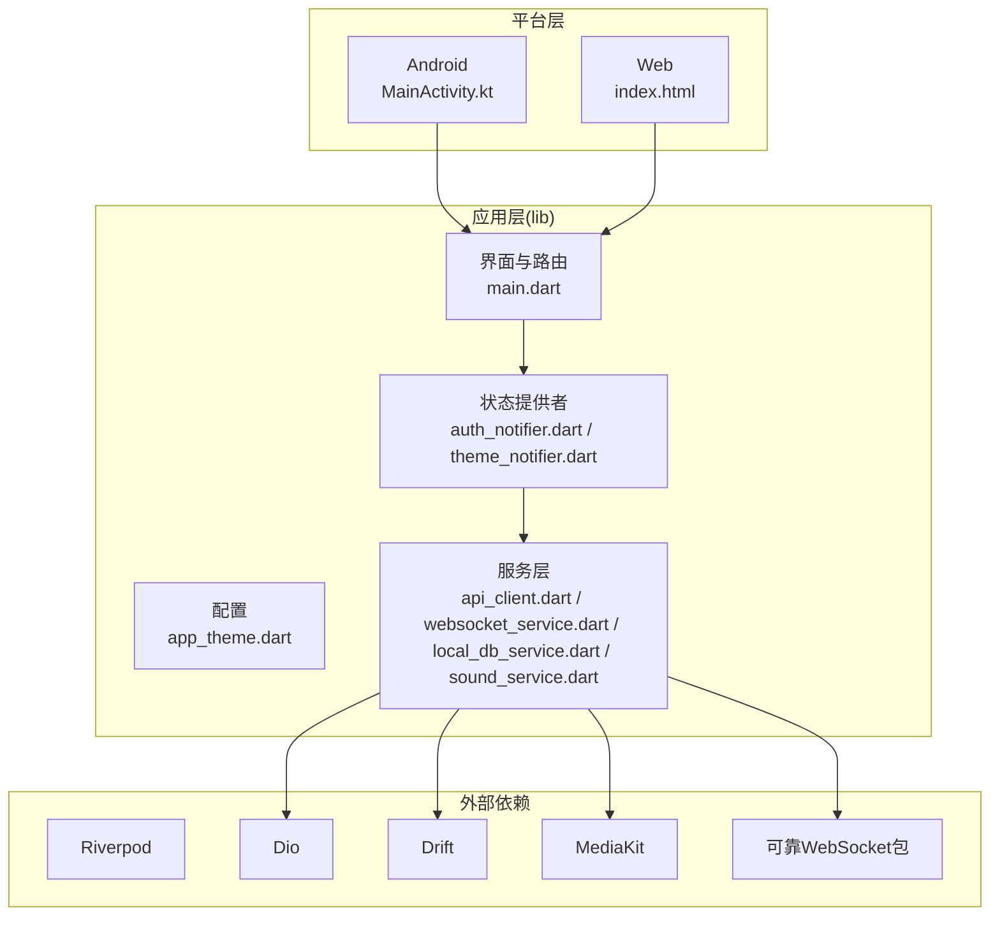
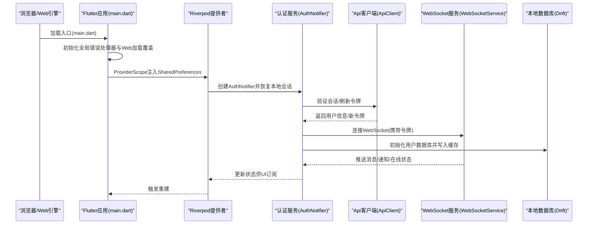
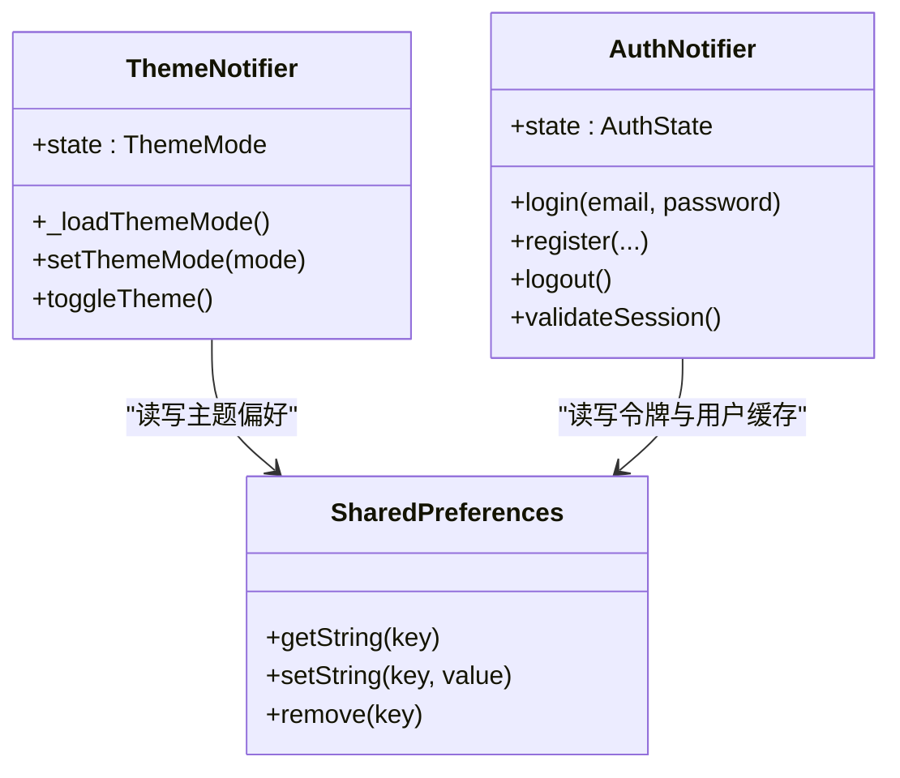
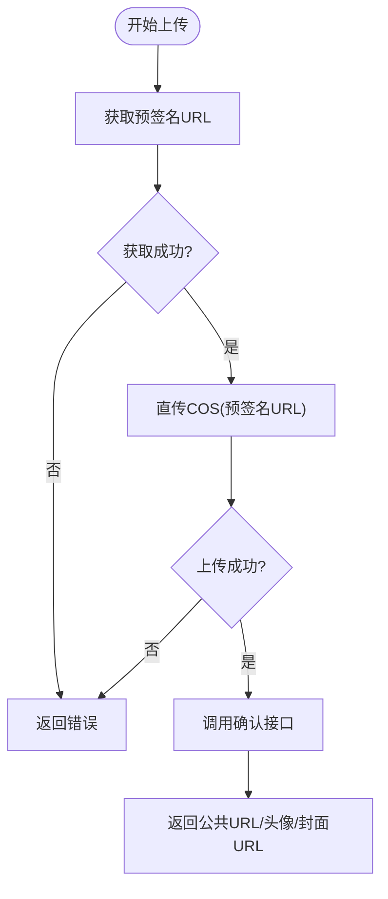
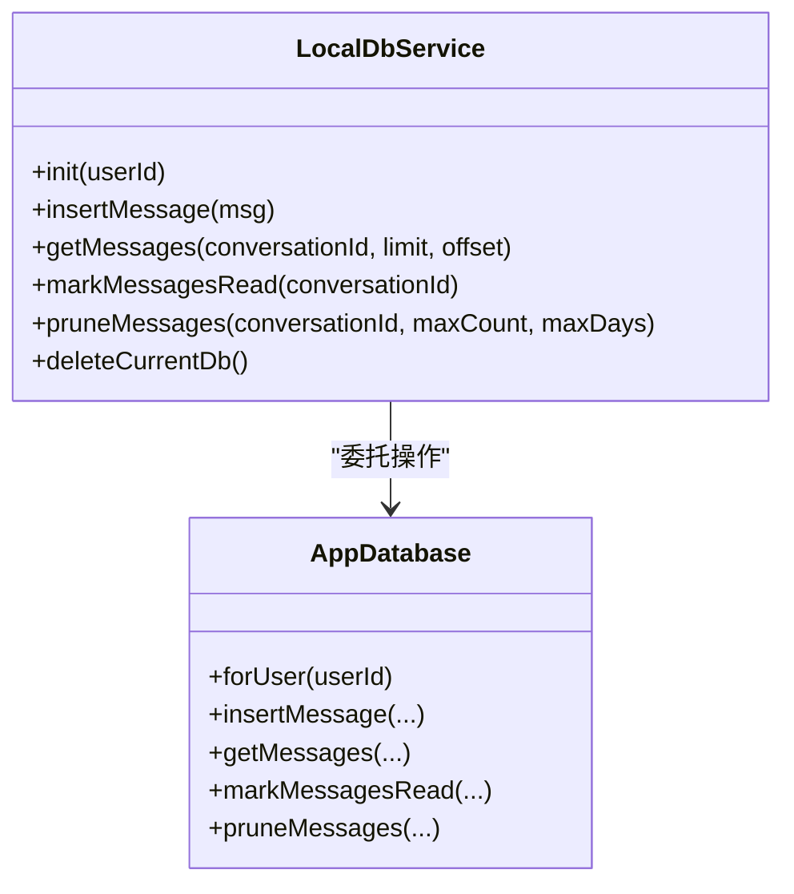
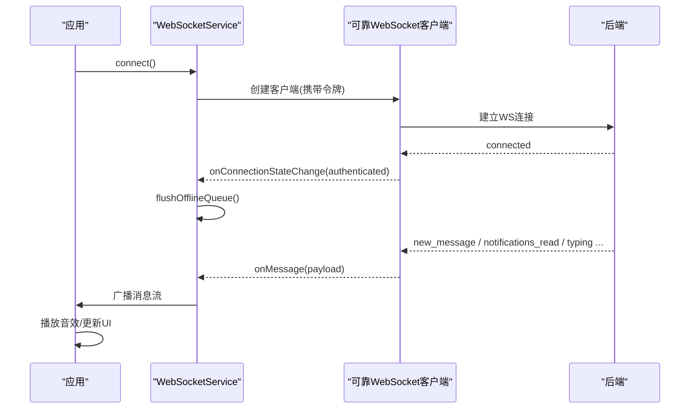
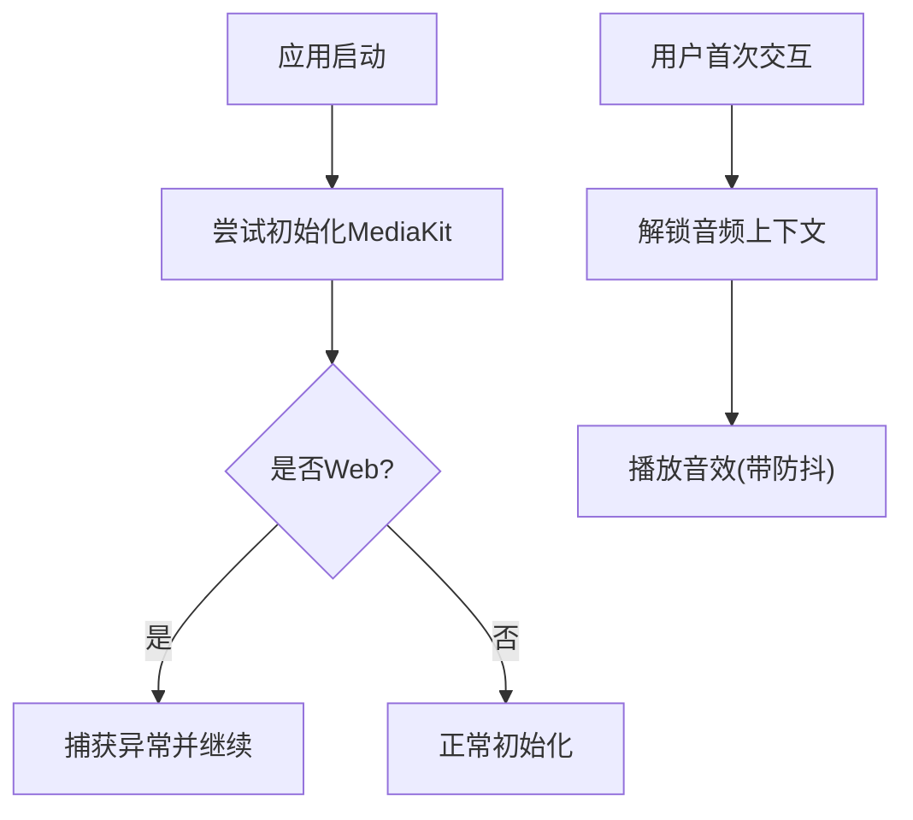
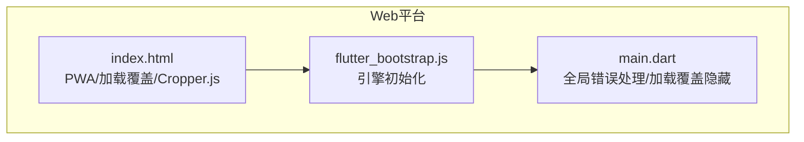
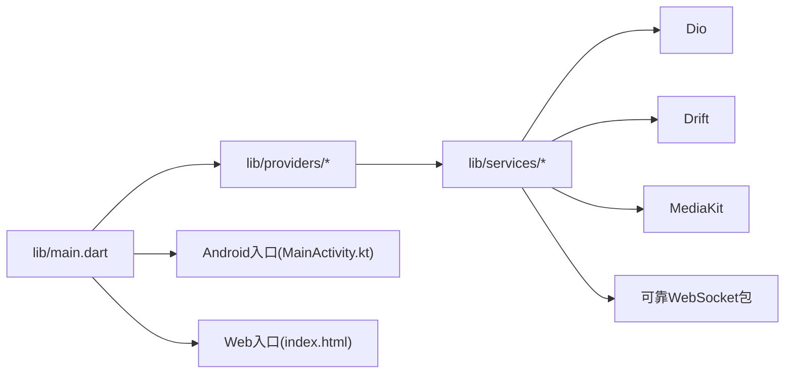

# 技术栈概览

<cite>
**本文档引用的文件**
- [pubspec.yaml](file://pubspec.yaml)
- [main.dart](file://lib/main.dart)
- [app_theme.dart](file://lib/config/app_theme.dart)
- [auth_notifier.dart](file://lib/providers/auth_notifier.dart)
- [theme_notifier.dart](file://lib/providers/theme_notifier.dart)
- [sound_service.dart](file://lib/services/sound_service.dart)
- [web_utils.dart](file://lib/services/web_utils.dart)
- [web_utils_web.dart](file://lib/services/web_utils_web.dart)
- [api_client.dart](file://lib/services/api/api_client.dart)
- [auth_service.dart](file://lib/services/api/auth_service.dart)
- [websocket_service.dart](file://lib/services/websocket_service.dart)
- [local_db_service.dart](file://lib/services/local_db_service.dart)
- [MainActivity.kt](file://android/app/src/main/kotlin/com/nonto/nonto/MainActivity.kt)
- [index.html](file://web/index.html)
- [reliable_websocket_pubspec.yaml](file://packages/reliable_websocket/pubspec.yaml)
</cite>

## 目录
1. [简介](#简介)
2. [项目结构](#项目结构)
3. [核心组件](#核心组件)
4. [架构总览](#架构总览)
5. [详细组件分析](#详细组件分析)
6. [依赖关系分析](#依赖关系分析)
7. [性能考量](#性能考量)
8. [故障排查指南](#故障排查指南)
9. [结论](#结论)
10. [附录：学习路径建议](#附录学习路径建议)

## 简介
本项目是一个基于 Flutter 的 Facebook 克隆应用，采用跨平台技术栈实现 Android、iOS 与 Web 三端统一开发。核心技术栈围绕以下关键组件构建：
- Flutter 主框架：统一 UI 渲染与原生能力访问
- Riverpod 状态管理：轻量、可测试、响应式状态
- Dio 网络请求库：类型安全、拦截器、上传优化
- Drift 本地数据库：跨平台 SQL 数据存储，支持 Web/WASM
- MediaKit 媒体播放：高性能跨平台视频播放
- 可靠 WebSocket 模块：消息确认、有序交付、离线队列与自动重连

本概览将系统阐述各技术选型的原因、优势、在项目中的作用与相互关系，并提供跨平台实现细节与学习路径建议。

## 项目结构
项目采用“按职责分层”的组织方式，核心目录与职责如下：
- lib：应用主体代码，包含配置、模型、提供者、路由、屏幕、服务、工具与小部件
- android：Android 平台入口与原生集成
- web：Web 平台入口与 PWA 资源
- packages：本地包，如可靠 WebSocket 模块

**图表来源**
- [main.dart:17-72](file://lib/main.dart#L17-L72)
- [auth_notifier.dart:21-377](file://lib/providers/auth_notifier.dart#L21-L377)
- [api_client.dart:15-404](file://lib/services/api/api_client.dart#L15-L404)
- [local_db_service.dart:10-246](file://lib/services/local_db_service.dart#L10-L246)
- [websocket_service.dart:10-223](file://lib/services/websocket_service.dart#L10-L223)
- [MainActivity.kt:1-6](file://android/app/src/main/kotlin/com/nonto/nonto/MainActivity.kt#L1-L6)
- [index.html:1-239](file://web/index.html#L1-L239)

**章节来源**
- [pubspec.yaml:30-82](file://pubspec.yaml#L30-L82)
- [main.dart:74-235](file://lib/main.dart#L74-L235)

## 核心组件
本节概述项目的关键技术组件及其在整体架构中的定位与职责。

- Flutter 主框架
  - 作为统一 UI 与原生能力访问层，负责应用启动、主题配置、路由生成与跨平台渲染
  - 在 Web 端通过 HTML 加载覆盖与错误处理保障用户体验

- Riverpod 状态管理
  - 通过 ProviderScope 注入全局依赖（如 SharedPreferences），并提供认证、主题等状态
  - 认证状态与主题状态均采用 StateNotifierProvider，确保可预测的状态变更与可测试性

- Dio 网络请求库
  - 封装统一的 ApiClient，集中处理请求头、鉴权、错误与上传流程
  - 支持 COS 预签名直传与上传确认，优化大文件传输体验

- Drift 本地数据库
  - 为聊天场景提供消息与会话的本地持久化，支持按用户隔离与清理
  - Web 端通过 WASM 与 IndexedDB 实现跨平台一致的数据层

- MediaKit 媒体播放
  - 在应用启动阶段进行初始化，并在 Web 端进行兼容性处理
  - 结合 VisibilityDetector 与视频缩略图等工具提升媒体体验

- 可靠 WebSocket 模块
  - 基于可靠 WebSocket 客户端，提供消息确认、有序交付、离线队列与自动重连
  - 与 Drift 结合实现离线消息同步与一致性保障

**章节来源**
- [main.dart:17-72](file://lib/main.dart#L17-L72)
- [auth_notifier.dart:21-377](file://lib/providers/auth_notifier.dart#L21-L377)
- [api_client.dart:15-404](file://lib/services/api/api_client.dart#L15-L404)
- [local_db_service.dart:10-246](file://lib/services/local_db_service.dart#L10-L246)
- [websocket_service.dart:10-223](file://lib/services/websocket_service.dart#L10-L223)
- [sound_service.dart:1-66](file://lib/services/sound_service.dart#L1-L66)

## 架构总览
下图展示了应用启动到状态管理、网络与数据库交互的整体流程，以及跨平台适配策略：

**图表来源**
- [main.dart:17-72](file://lib/main.dart#L17-L72)
- [auth_notifier.dart:25-202](file://lib/providers/auth_notifier.dart#L25-L202)
- [api_client.dart:26-53](file://lib/services/api/api_client.dart#L26-L53)
- [websocket_service.dart:36-69](file://lib/services/websocket_service.dart#L36-L69)
- [local_db_service.dart:21-27](file://lib/services/local_db_service.dart#L21-L27)

## 详细组件分析

### 状态管理与主题系统（Riverpod）
- 认证状态管理
  - 采用 StateNotifierProvider 管理登录态、用户信息与错误状态
  - 启动阶段从 SharedPreferences 恢复会话，避免首屏等待
  - 登录/注册/刷新/注销流程中维护令牌与用户缓存，并触发 WebSocket 连接与本地数据库初始化

- 主题管理
  - ThemeNotifier 基于 SharedPreferences 记录主题模式并在运行时切换
  - 与 MaterialApp 的主题配置结合，实现明暗主题无缝切换

**图表来源**
- [theme_notifier.dart:8-38](file://lib/providers/theme_notifier.dart#L8-L38)
- [auth_notifier.dart:21-377](file://lib/providers/auth_notifier.dart#L21-L377)
- [main.dart:62-68](file://lib/main.dart#L62-L68)

**章节来源**
- [theme_notifier.dart:8-38](file://lib/providers/theme_notifier.dart#L8-L38)
- [auth_notifier.dart:25-202](file://lib/providers/auth_notifier.dart#L25-L202)
- [main.dart:62-68](file://lib/main.dart#L62-L68)

### 网络层与上传优化（Dio）
- 统一拦截器
  - 自动注入 Bearer 令牌（仅对自有域名）
  - 401 自动清空令牌
- 上传流程
  - 先向后端获取 COS 预签名 URL，再直传至对象存储
  - 支持字节数组与文件对象上传，自动设置 Content-Type
  - 上传完成后调用确认接口，必要时回填头像/封面 URL

**图表来源**
- [api_client.dart:95-339](file://lib/services/api/api_client.dart#L95-L339)

**章节来源**
- [api_client.dart:26-53](file://lib/services/api/api_client.dart#L26-L53)
- [api_client.dart:204-339](file://lib/services/api/api_client.dart#L204-L339)

### 本地数据库与消息持久化（Drift）
- 数据库初始化
  - 按用户 ID 初始化数据库实例，实现多账号隔离
  - 与 DataLayer 集成，支持离线队列与后台预热
- 消息与会话操作
  - 提供插入、查询、标记已读、清理与删除等完整 CRUD
  - 支持按会话裁剪历史消息，控制存储占用

**图表来源**
- [local_db_service.dart:10-246](file://lib/services/local_db_service.dart#L10-L246)

**章节来源**
- [local_db_service.dart:21-27](file://lib/services/local_db_service.dart#L21-L27)
- [local_db_service.dart:31-90](file://lib/services/local_db_service.dart#L31-L90)

### 实时通信与可靠消息（WebSocket + 可靠模块）
- 连接建立
  - 登录成功后携带令牌连接 WebSocket
  - 连接即认证，认证失败自动断开
- 消息类型处理
  - 新消息、会话已读、发送确认、离线同步、通知、在线状态、正在输入等
  - 自动播放相应音效，提升交互反馈
- 离线队列
  - 连接恢复后自动推送离线消息，保证消息可达性

**图表来源**
- [websocket_service.dart:36-146](file://lib/services/websocket_service.dart#L36-L146)
- [reliable_websocket_pubspec.yaml:10-21](file://packages/reliable_websocket/pubspec.yaml#L10-L21)

**章节来源**
- [websocket_service.dart:36-146](file://lib/services/websocket_service.dart#L36-L146)
- [reliable_websocket_pubspec.yaml:10-21](file://packages/reliable_websocket/pubspec.yaml#L10-L21)

### 媒体播放与音效系统（MediaKit + 条件导入）
- 媒体播放
  - 应用启动时初始化 MediaKit；Web 端捕获异常并继续运行
  - 结合可见性检测与视频缩略图，优化视频体验
- 音效系统
  - 条件导入 Web 与原生实现，统一接口
  - 防抖机制避免重复播放同一音效
  - 首次用户交互后解锁浏览器音频上下文

**图表来源**
- [main.dart:34-40](file://lib/main.dart#L34-L40)
- [sound_service.dart:24-48](file://lib/services/sound_service.dart#L24-L48)

**章节来源**
- [main.dart:34-40](file://lib/main.dart#L34-L40)
- [sound_service.dart:12-66](file://lib/services/sound_service.dart#L12-L66)

### 跨平台支持与 Web 适配
- Android
  - 标准 FlutterActivity 入口，继承自 Flutter 官方模板
- Web
  - 通过 index.html 提供 PWA 与加载覆盖
  - 全局错误处理器与 hideWebLoadingOverlay 确保初始化失败时加载屏不会卡死
  - Drift 自动使用 WASM/IndexedDB，无需额外配置
  - 图片裁剪依赖 CDN 的 Cropper.js（由 index.html 引入）

**图表来源**
- [index.html:177-235](file://web/index.html#L177-L235)
- [main.dart:20-32](file://lib/main.dart#L20-L32)
- [web_utils_web.dart:8-22](file://lib/services/web_utils_web.dart#L8-L22)

**章节来源**
- [MainActivity.kt:1-6](file://android/app/src/main/kotlin/com/nonto/nonto/MainActivity.kt#L1-L6)
- [index.html:177-235](file://web/index.html#L177-L235)
- [web_utils_web.dart:8-22](file://lib/services/web_utils_web.dart#L8-L22)

## 依赖关系分析
项目依赖关系清晰，遵循“服务层聚合外部库”的原则，避免上层直接耦合底层实现。

**图表来源**
- [pubspec.yaml:30-82](file://pubspec.yaml#L30-L82)
- [main.dart:13-15](file://lib/main.dart#L13-L15)

**章节来源**
- [pubspec.yaml:30-82](file://pubspec.yaml#L30-L82)
- [main.dart:13-15](file://lib/main.dart#L13-L15)

## 性能考量
- 启动阶段优化
  - SharedPreferences 失败重试与 Web 加载覆盖隐藏，减少首屏卡顿
  - MediaKit 初始化异常捕获，避免阻塞主线程
- 网络与存储
  - COS 预签名直传减少中间代理，降低延迟与带宽成本
  - Drift 按会话裁剪历史消息，控制存储增长
- 媒体与音效
  - MediaKit 与可见性检测配合，仅在可见时播放，节省资源
  - 音效防抖避免频繁 IO

## 故障排查指南
- Web 初始化失败导致加载屏卡死
  - 确认全局错误处理器已触发 hideWebLoadingOverlay
  - 检查 MediaKit 初始化与 SharedPreferences 获取是否抛出异常
- WebSocket 连接失败
  - 核对令牌是否正确注入与后端认证逻辑
  - 查看连接状态变更回调与离线队列是否被正确刷新
- 上传失败
  - 检查预签名 URL 获取与直传返回码
  - 确认上传确认接口与头像/封面专用确认接口调用链
- 主题切换无效
  - 确认 ThemeNotifier 已写入 SharedPreferences 并触发状态更新

**章节来源**
- [main.dart:20-32](file://lib/main.dart#L20-L32)
- [web_utils_web.dart:8-22](file://lib/services/web_utils_web.dart#L8-L22)
- [websocket_service.dart:59-80](file://lib/services/websocket_service.dart#L59-L80)
- [api_client.dart:281-339](file://lib/services/api/api_client.dart#L281-L339)
- [theme_notifier.dart:17-25](file://lib/providers/theme_notifier.dart#L17-L25)

## 结论
本项目通过 Flutter 跨平台框架与 Riverpod 状态管理，结合 Dio 网络层、Drift 数据层与 MediaKit 媒体层，构建了稳定、可扩展且具备良好用户体验的社交应用骨架。可靠 WebSocket 模块进一步强化了实时通信能力。跨平台适配策略明确，Web 与原生平台在关键路径上保持一致行为，便于维护与扩展。

## 附录：学习路径建议
- Flutter 基础
  - 官方教程与 Widgets 体系，理解状态管理与生命周期
- Riverpod
  - Provider、AsyncNotifier、StateNotifierProvider 的使用场景与最佳实践
- Dio
  - 拦截器、超时、错误处理与上传优化策略
- Drift
  - 数据库设计、表结构与查询优化，Web/WASM 适配
- MediaKit
  - 跨平台媒体播放、可见性检测与性能优化
- WebSocket 与可靠性
  - 消息确认、有序交付、离线队列与自动重连的设计思想
- 跨平台与 Web 适配
  - Web 加载覆盖、错误处理、PWA 与资源加载策略