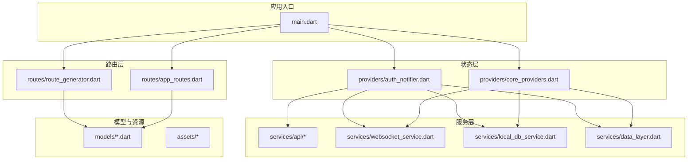
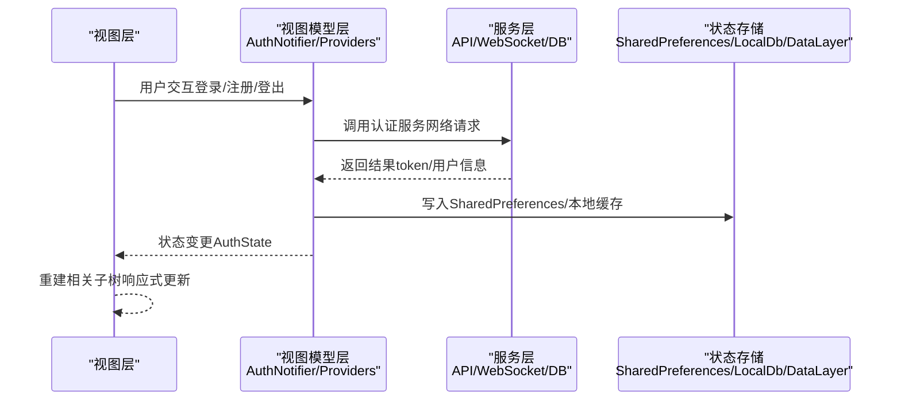
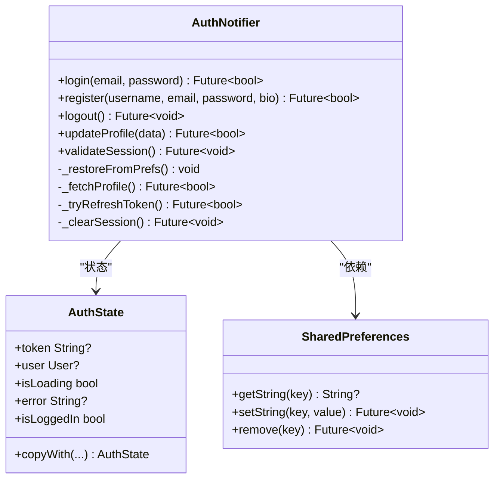
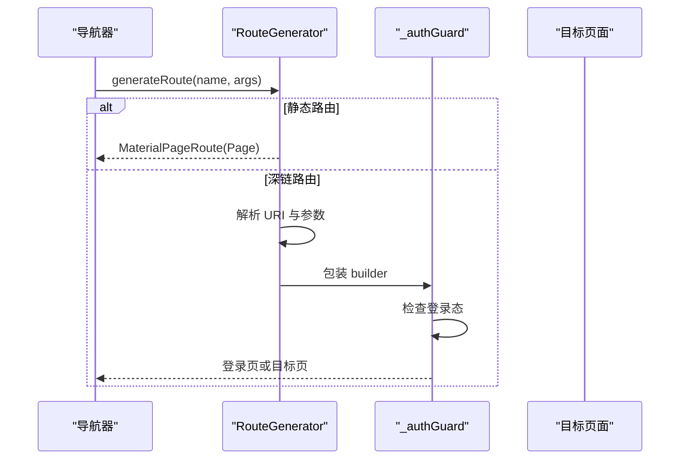
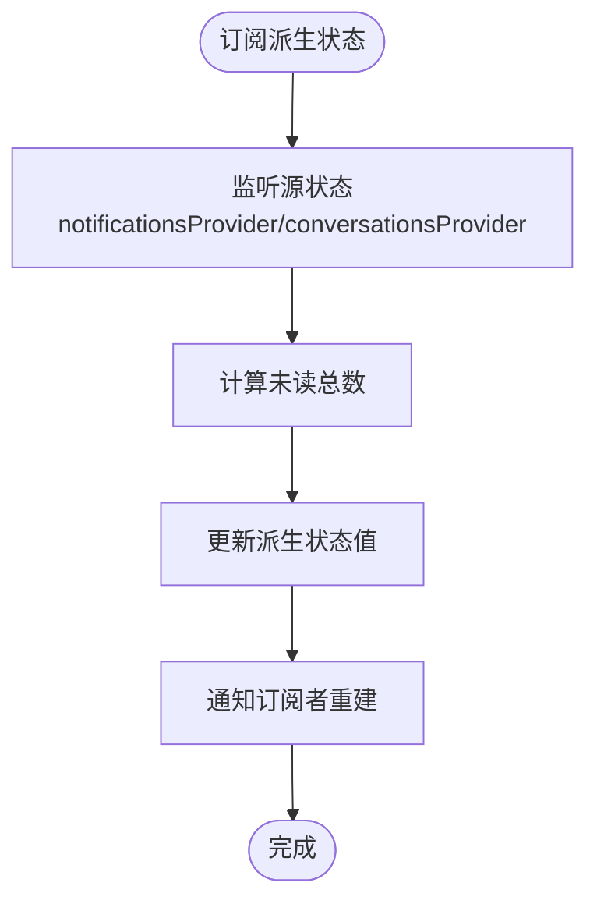
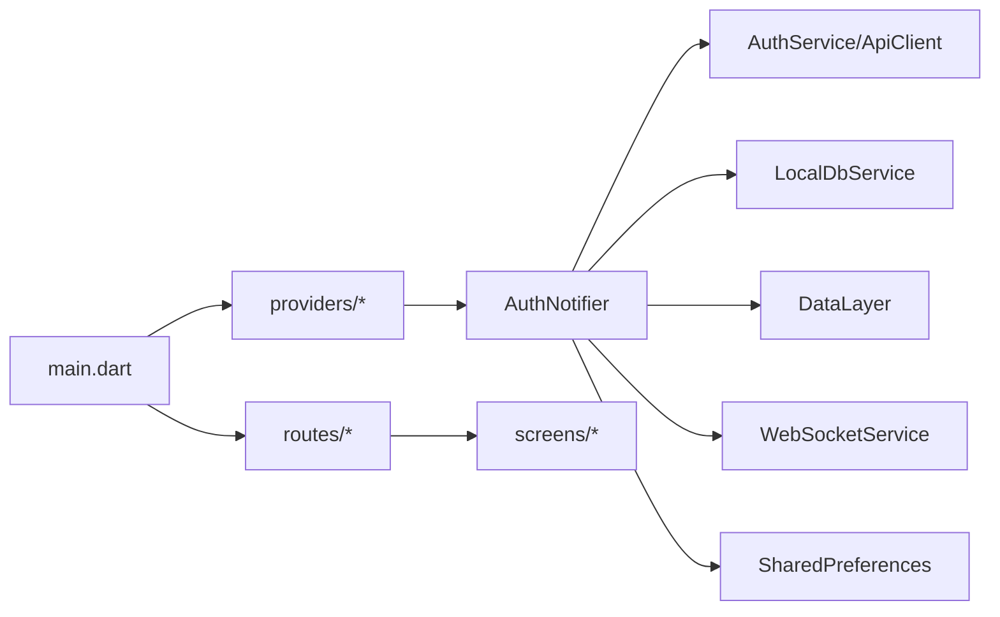

# 架构设计理念

<cite>
**本文引用的文件**
- [main.dart](file://lib/main.dart)
- [pubspec.yaml](file://pubspec.yaml)
- [core_providers.dart](file://lib/providers/core_providers.dart)
- [auth_notifier.dart](file://lib/providers/auth_notifier.dart)
- [app_routes.dart](file://lib/routes/app_routes.dart)
- [route_generator.dart](file://lib/routes/route_generator.dart)
</cite>

## 目录
1. [引言](#引言)
2. [项目结构](#项目结构)
3. [核心组件](#核心组件)
4. [架构总览](#架构总览)
5. [详细组件分析](#详细组件分析)
6. [依赖关系分析](#依赖关系分析)
7. [性能考虑](#性能考虑)
8. [故障排查指南](#故障排查指南)
9. [结论](#结论)
10. [附录](#附录)

## 引言
本项目是一个基于 Flutter 的 Facebook 克隆应用，整体采用 MVVM 架构理念与响应式编程思想，结合分层架构与 Provider 模式（Riverpod）进行状态管理与组件解耦。项目在移动端与 Web 端统一运行，通过依赖注入与 ProviderScope 实现全局状态的集中管理；路由系统采用统一的路由生成器与守卫机制，确保认证态下的页面访问控制；数据流以 Provider 为核心，围绕状态变更驱动 UI 响应更新。

## 项目结构
项目采用按职责分层的目录组织方式：
- lib/main.dart：应用入口，负责全局错误处理、平台初始化、主题配置、路由挂载与 ProviderScope 注入。
- lib/providers：状态与服务提供者集合，包含核心 Provider、认证 Provider、通知与聊天等派生状态。
- lib/routes：路由常量与路由生成器，统一管理页面跳转与深链参数解析。
- lib/services：业务服务层（API 客户端、本地数据库、WebSocket、数据层等），作为 Provider 的依赖注入对象。
- lib/models：领域模型，承载用户、帖子、评论、消息等数据结构。
- lib/widgets/utils/config：UI 组件、工具类与主题配置。
- pubspec.yaml：依赖声明与版本约束，包含 Riverpod、Drift、MediaKit、WebSocket 等关键库。

图表来源
- [main.dart:17-72](file://lib/main.dart#L17-L72)
- [app_routes.dart:1-37](file://lib/routes/app_routes.dart#L1-L37)
- [route_generator.dart:26-136](file://lib/routes/route_generator.dart#L26-L136)
- [core_providers.dart:1-39](file://lib/providers/core_providers.dart#L1-L39)
- [auth_notifier.dart:15-377](file://lib/providers/auth_notifier.dart#L15-L377)

章节来源
- [main.dart:17-72](file://lib/main.dart#L17-L72)
- [pubspec.yaml:30-74](file://pubspec.yaml#L30-L74)

## 核心组件
- ProviderScope 与全局覆盖：在应用启动时通过 ProviderScope.overrides 注入已初始化的 SharedPreferences，确保后续所有依赖该 Provider 的组件都能获得一致的共享偏好实例。
- 主题与暗黑模式：通过 ConsumerWidget 订阅 themeProvider，动态切换明/暗主题，Material 3 与自定义颜色体系保证视觉一致性。
- 路由与导航：onGenerateRoute 使用 RouteGenerator.generateRoute，集中处理静态路由与深链参数解析，并内置认证守卫。
- 认证状态管理：AuthNotifier 采用三阶段初始化策略（同步恢复、后台校验、公开动作），封装登录、注册、登出、资料更新等操作，状态变更通过 Riverpod 驱动 UI 更新。
- 核心 Provider：提供 DataLayer、WebSocket、LocalDbService 单例包装，以及当前 Tab 索引、底部栏可见性、未读计数等派生状态。

章节来源
- [main.dart:61-68](file://lib/main.dart#L61-L68)
- [main.dart:74-234](file://lib/main.dart#L74-L234)
- [core_providers.dart:9-39](file://lib/providers/core_providers.dart#L9-L39)
- [auth_notifier.dart:15-377](file://lib/providers/auth_notifier.dart#L15-L377)

## 架构总览
本项目采用 MVVM + 分层 + Provider 的混合架构：
- 视图层（View）：Flutter Widget，通过 ConsumerWidget/Consumer 订阅 Provider，响应状态变化。
- 模型层（Model）：领域对象（User、Post、Comment 等），用于承载数据与业务语义。
- 视图模型层（ViewModel）：以 Riverpod Provider 与 StateNotifier 形式存在，封装业务逻辑与状态转换。
- 服务层（Service）：API 客户端、本地数据库、WebSocket、数据缓存等，作为 Provider 的依赖对象。
- 数据流：从 UI 触发动作 → ViewModel 处理 → Service 执行 → 状态变更 → 视图自动刷新。

图表来源
- [auth_notifier.dart:213-354](file://lib/providers/auth_notifier.dart#L213-L354)
- [main.dart:61-68](file://lib/main.dart#L61-L68)

## 详细组件分析

### 认证状态管理（AuthNotifier 与 Provider）
- 设计要点
  - 三阶段初始化：构造函数内同步从 SharedPreferences 恢复 token 与用户缓存，避免首帧白屏；随后在后台执行网络校验与数据库初始化。
  - 网络校验：validateSession 在超时时间内尝试拉取用户资料或刷新 token，失败则清理会话。
  - 公开动作：login/register/updateProfile/logout 封装完整流程，包括 token 管理、WebSocket 连接、本地缓存与数据层写入。
  - 状态模型：AuthState 作为不可变快照，配合 copyWith 提升可读性与可维护性。
- Provider 绑定
  - sharedPreferencesProvider 通过 ProviderScope.overrides 注入，authProvider 基于 StateNotifierProvider 包装 AuthNotifier。
  - currentUserProvider 与 isLoggedInProvider 作为派生状态，简化 UI 订阅。

图表来源
- [auth_notifier.dart:21-377](file://lib/providers/auth_notifier.dart#L21-L377)

章节来源
- [auth_notifier.dart:15-377](file://lib/providers/auth_notifier.dart#L15-L377)

### 路由管理（AppRoutes 与 RouteGenerator）
- 设计思路
  - AppRoutes 定义静态路由与命名参数占位符，便于集中管理与类型安全。
  - RouteGenerator.generateRoute 统一处理静态路由映射与深链参数解析（如 /profile/:id、/post/:id、/comic/detail/:id）。
  - 认证守卫：_authGuard 在访问受保护页面前检查登录态，未登录则重定向到登录页。
- 数据流向
  - 路由设置在 MaterialApp 中通过 onGenerateRoute 与 initialRoute 配置，导航触发后由 RouteGenerator 解析并构建页面。
  - 参数化路由通过 Uri 解析与类型转换，确保参数安全传递至目标页面。

图表来源
- [route_generator.dart:26-136](file://lib/routes/route_generator.dart#L26-L136)
- [app_routes.dart:1-37](file://lib/routes/app_routes.dart#L1-L37)

章节来源
- [route_generator.dart:26-136](file://lib/routes/route_generator.dart#L26-L136)
- [app_routes.dart:1-37](file://lib/routes/app_routes.dart#L1-L37)

### 核心 Provider 与派生状态
- 单例服务 Provider：DataLayer、WebSocketService、LocalDbService 以常规 Provider 形式暴露，生命周期由各自单例管理。
- 本地状态 Provider：currentTabIndexProvider 与 barVisibleProvider 替代传统 setState，减少不必要的整树重建。
- 派生状态 Provider：unreadNotificationsCountProvider 与 unreadMessagesCountProvider 基于其他 Provider 的状态计算，实现未读计数的自动更新。

图表来源
- [core_providers.dart:28-38](file://lib/providers/core_providers.dart#L28-L38)

章节来源
- [core_providers.dart:9-39](file://lib/providers/core_providers.dart#L9-L39)

### 应用入口与全局配置
- 启动流程
  - 全局错误处理器：Web 端捕获未处理异常，隐藏加载遮罩，避免 UI 卡死。
  - MediaKit 初始化：在非 Web 平台确保媒体能力可用，Web 端降级处理。
  - SharedPreferences 初始化：容错重试，避免因浏览器 localStorage 事件循环导致的初始化失败。
  - ProviderScope 注入：将已初始化的 SharedPreferences 注入到应用树，供 authProvider 等使用。
- 主题配置
  - 明/暗主题分别定义 Material 3 主题、颜色体系、文本样式、输入框样式与按钮样式，统一视觉风格。

章节来源
- [main.dart:17-72](file://lib/main.dart#L17-L72)
- [main.dart:74-234](file://lib/main.dart#L74-L234)

## 依赖关系分析
- 外部依赖
  - Riverpod：状态管理与响应式更新的核心。
  - Drift：跨平台数据库（原生平台 SQLite，Web 通过 WASM/IndexedDB），与 LocalDbService 协同。
  - MediaKit：视频播放能力（原生平台），Web 端降级处理。
  - WebSocket：实时通信（web_socket_channel + reliable_websocket）。
  - Dio：HTTP 客户端。
  - shared_preferences：跨平台持久化首选项。
- 内部依赖
  - AuthNotifier 依赖 AuthService、ApiClient、LocalDbService、DataLayer、WebSocketService、SharedPreferences。
  - RouteGenerator 依赖各 Screen 页面与 Provider（认证守卫中读取 authProvider）。

图表来源
- [main.dart:61-68](file://lib/main.dart#L61-L68)
- [auth_notifier.dart:5-13](file://lib/providers/auth_notifier.dart#L5-L13)
- [route_generator.dart:4-22](file://lib/routes/route_generator.dart#L4-L22)

章节来源
- [pubspec.yaml:30-74](file://pubspec.yaml#L30-L74)
- [auth_notifier.dart:5-13](file://lib/providers/auth_notifier.dart#L5-L13)
- [route_generator.dart:4-22](file://lib/routes/route_generator.dart#L4-L22)

## 性能考虑
- 响应式渲染与局部重建
  - 使用 Riverpod 的细粒度订阅与不可变状态，仅在相关状态变更时重建对应子树，降低重建成本。
- 初始化与懒加载
  - 认证恢复阶段避免等待网络请求，优先展示缓存状态；后台异步初始化数据库与数据层，提升首帧体验。
- 平台差异处理
  - Web 端对 MediaKit 与 Drift 进行降级处理，避免初始化失败影响整体启动。
- 未读计数与派生状态
  - 通过 Provider 的派生状态计算未读总数，避免在多个页面重复计算，减少重复渲染与计算开销。

## 故障排查指南
- Web 端启动卡顿
  - 现象：HTML 加载遮罩不消失。
  - 处理：检查全局错误处理器是否正确调用隐藏遮罩；确认 MediaKit 初始化异常被捕获且不影响后续流程。
- SharedPreferences 初始化失败
  - 现象：应用启动时报错或直接退出。
  - 处理：启用容错重试逻辑；确认浏览器 localStorage 权限与事件循环状态。
- 认证态异常
  - 现象：登录成功但首页仍显示未登录。
  - 处理：检查 token 写入与 ApiClient.setToken 是否执行；确认 WebSocket 连接与 DataLayer 写入是否成功；验证 ProviderScope 注入的 SharedPreferences 是否正确。
- 路由参数解析错误
  - 现象：深链路由无法正确解析或跳转到错误页面。
  - 处理：核对 AppRoutes 常量与 RouteGenerator 的 URI 解析分支；确保参数类型转换与默认值处理。

章节来源
- [main.dart:20-32](file://lib/main.dart#L20-L32)
- [main.dart:48-59](file://lib/main.dart#L48-L59)
- [auth_notifier.dart:213-354](file://lib/providers/auth_notifier.dart#L213-L354)
- [route_generator.dart:74-111](file://lib/routes/route_generator.dart#L74-L111)

## 结论
本项目通过 MVVM 与分层架构，结合 Riverpod 的响应式状态管理与 Provider 模式，实现了清晰的职责分离与高可维护性。认证流程采用三阶段初始化策略，兼顾首帧体验与会话稳定性；路由系统统一入口与守卫机制，保障访问安全；派生状态与细粒度订阅提升了渲染效率。整体架构在移动端与 Web 端保持一致体验，并通过平台差异处理与容错机制增强健壮性。

## 附录
- 最佳实践建议
  - 将所有副作用（网络、存储、WebSocket）封装在服务层，保持 Provider 的纯净与可测试性。
  - 对复杂状态使用 StateNotifier 与不可变快照，配合 copyWith 提升可读性。
  - 使用派生状态聚合计算结果，避免在多处重复计算。
  - 对关键初始化步骤添加容错与降级策略，确保 Web 端稳定运行。
  - 为路由与 Provider 添加单元测试与集成测试，覆盖认证守卫与状态变更路径。