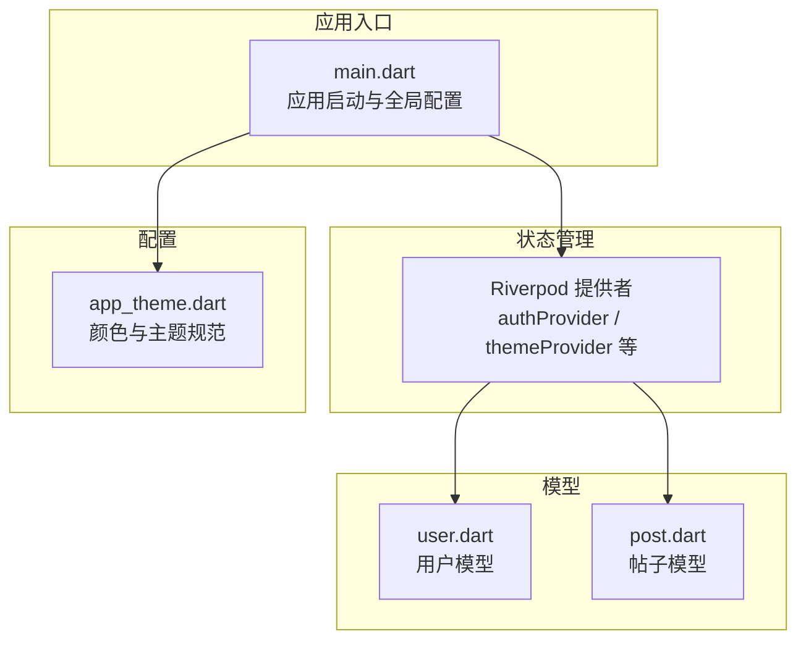
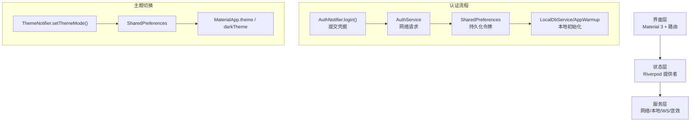
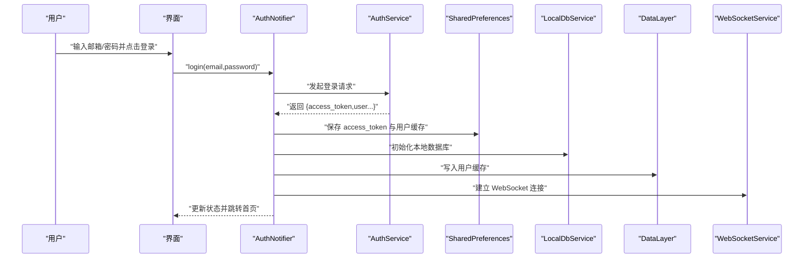
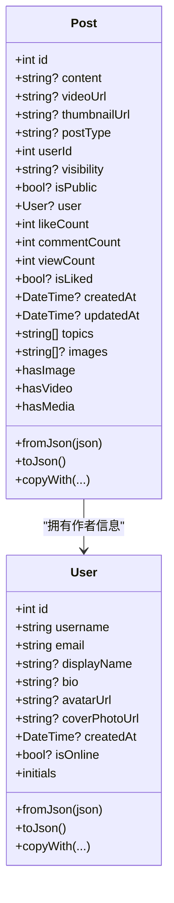
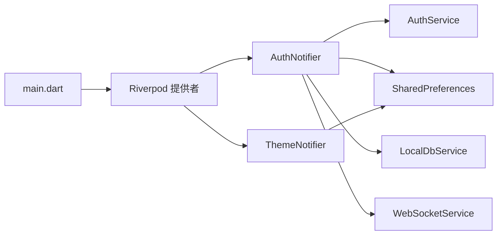

# 核心功能特性

<cite>
**本文档引用的文件**
- [lib/main.dart](file://lib/main.dart)
- [lib/config/app_theme.dart](file://lib/config/app_theme.dart)
- [lib/providers/auth_notifier.dart](file://lib/providers/auth_notifier.dart)
- [lib/providers/theme_notifier.dart](file://lib/providers/theme_notifier.dart)
- [lib/models/user.dart](file://lib/models/user.dart)
- [lib/models/post.dart](file://lib/models/post.dart)
</cite>

## 目录
1. [简介](#简介)
2. [项目结构](#项目结构)
3. [核心组件](#核心组件)
4. [架构总览](#架构总览)
5. [详细组件分析](#详细组件分析)
6. [依赖分析](#依赖分析)
7. [性能考量](#性能考量)
8. [故障排查指南](#故障排查指南)
9. [结论](#结论)

## 简介
本项目是一个基于 Flutter 的 Facebook 克隆应用，采用 Riverpod 状态管理与 Material 3 设计语言，覆盖用户认证、动态流、个人资料、主题切换、媒体播放、离线缓存等核心能力。本文档从设计思路、技术实现与用户体验三个维度，系统梳理各功能模块的协作关系与数据流转模式，既为初学者提供清晰的功能概览，也为有经验的开发者提炼实现要点。

## 项目结构
- 应用入口负责全局错误处理、平台初始化、主题与路由装配，以及 Riverpod 提供者注入。
- 配置层提供统一的主题与颜色规范，确保跨屏一致的视觉体验。
- 状态层以 Riverpod 为核心，分离认证、主题、聊天、评论、探索等状态域，提升可维护性与可测试性。
- 模型层定义用户、帖子、消息、通知等实体，统一序列化/反序列化与字段兼容逻辑。
- 服务层抽象网络、本地数据库、WebSocket、音效等外部能力，便于替换与扩展。

图表来源
- [lib/main.dart:74-234](file://lib/main.dart#L74-L234)
- [lib/config/app_theme.dart:1-51](file://lib/config/app_theme.dart#L1-L51)
- [lib/providers/auth_notifier.dart:21-377](file://lib/providers/auth_notifier.dart#L21-L377)
- [lib/providers/theme_notifier.dart:8-38](file://lib/providers/theme_notifier.dart#L8-L38)
- [lib/models/user.dart:1-78](file://lib/models/user.dart#L1-L78)
- [lib/models/post.dart:1-111](file://lib/models/post.dart#L1-L111)

章节来源
- [lib/main.dart:17-72](file://lib/main.dart#L17-L72)
- [lib/config/app_theme.dart:3-51](file://lib/config/app_theme.dart#L3-L51)

## 核心组件
- 应用入口与全局配置：在启动阶段设置错误处理器、初始化媒体库、处理 Web 平台差异、注入共享偏好提供者，并构建主题与路由体系。
- 认证与会话管理：通过 AuthNotifier 实现登录、注册、令牌刷新、会话校验与登出；持久化用户信息与令牌，支持后台预热与本地数据库初始化。
- 主题与外观：ThemeNotifier 基于 SharedPreferences 切换明暗主题，并与全局主题配置联动。
- 数据模型：User 与 Post 模型提供统一的 JSON 映射、字段容错与便捷方法，支撑动态流与个人资料展示。
- 状态提供者：authProvider/currentUserProvider/isLoggedInProvider 等，为 UI 层提供细粒度的状态订阅。

章节来源
- [lib/main.dart:74-234](file://lib/main.dart#L74-L234)
- [lib/providers/auth_notifier.dart:21-377](file://lib/providers/auth_notifier.dart#L21-L377)
- [lib/providers/theme_notifier.dart:8-38](file://lib/providers/theme_notifier.dart#L8-L38)
- [lib/models/user.dart:1-78](file://lib/models/user.dart#L1-L78)
- [lib/models/post.dart:1-111](file://lib/models/post.dart#L1-L111)

## 架构总览
整体采用“三层架构”思想：
- 表现层：UI 使用 Material 3 主题与路由导航，通过 Riverpod 订阅状态。
- 状态层：Riverpod 提供者封装业务状态与副作用，如认证、主题、动态流等。
- 服务层：网络请求、本地存储、WebSocket、音效等能力通过服务类抽象，避免 UI 直接耦合。

图表来源
- [lib/main.dart:74-234](file://lib/main.dart#L74-L234)
- [lib/providers/auth_notifier.dart:213-259](file://lib/providers/auth_notifier.dart#L213-L259)
- [lib/providers/theme_notifier.dart:22-31](file://lib/providers/theme_notifier.dart#L22-L31)

## 详细组件分析

### 用户认证系统（登录、注册、会话管理）
- 设计思路
  - 同步恢复：启动时从本地偏好读取令牌与用户缓存，立即设置初始状态，保证首页首帧可见正确登录态。
  - 背景校验：无阻塞地拉取远端资料与刷新令牌，失败则清理会话，确保安全与一致性。
  - 失败兜底：网络异常或解析失败时，记录日志并清理本地状态，避免卡死。
- 技术实现
  - 登录/注册：调用 AuthService 获取访问令牌，持久化令牌与用户信息，初始化本地数据库与缓存，连接 WebSocket，触发应用预热。
  - 会话校验：定时或首次进入时执行，若远端校验失败则尝试刷新令牌，失败则强制登出。
  - 登出：清除令牌、断开 WebSocket、清空本地缓存与数据库、移除偏好项。
- 用户体验
  - 首帧即见登录态，减少等待；后台刷新令牌避免频繁登录；错误明确提示并引导重试。

图表来源
- [lib/providers/auth_notifier.dart:213-259](file://lib/providers/auth_notifier.dart#L213-L259)
- [lib/providers/auth_notifier.dart:140-164](file://lib/providers/auth_notifier.dart#L140-L164)
- [lib/providers/auth_notifier.dart:166-191](file://lib/providers/auth_notifier.dart#L166-L191)
- [lib/providers/auth_notifier.dart:345-354](file://lib/providers/auth_notifier.dart#L345-L354)

章节来源
- [lib/providers/auth_notifier.dart:25-80](file://lib/providers/auth_notifier.dart#L25-L80)
- [lib/providers/auth_notifier.dart:88-113](file://lib/providers/auth_notifier.dart#L88-L113)
- [lib/providers/auth_notifier.dart:213-317](file://lib/providers/auth_notifier.dart#L213-L317)
- [lib/providers/auth_notifier.dart:345-354](file://lib/providers/auth_notifier.dart#L345-L354)

### 动态流展示与内容管理
- 设计思路
  - 帖子模型抽象图文/视频/话题等多形态内容，统一时间戳与计数字段，兼容后端不同字段命名。
  - 支持可见性控制与公开/私密标记，便于后续扩展权限体系。
- 技术实现
  - Post.fromJson 兼容 author/user 字段，解析日期与数组字段，提供 copyWith 更新局部状态。
  - 与认证状态联动，动态流渲染当前用户头像、昵称与互动按钮。
- 用户体验
  - 内容加载稳定，媒体资源按需显示，交互反馈及时。

图表来源
- [lib/models/user.dart:1-78](file://lib/models/user.dart#L1-L78)
- [lib/models/post.dart:1-111](file://lib/models/post.dart#L1-L111)

章节来源
- [lib/models/post.dart:48-90](file://lib/models/post.dart#L48-L90)
- [lib/models/user.dart:29-56](file://lib/models/user.dart#L29-L56)

### 个人资料管理
- 设计思路
  - 将用户头像、封面、简介等字段统一建模，支持在线状态标记，便于在动态流与聊天中展示。
  - 提供 copyWith 生成新实例，避免直接修改状态引发不可控副作用。
- 技术实现
  - 更新头像/封面/简介时，调用更新接口并同步到本地缓存与偏好，保持 UI 即时更新。
- 用户体验
  - 修改即时生效，支持回滚与重试。

章节来源
- [lib/models/user.dart:58-77](file://lib/models/user.dart#L58-L77)
- [lib/providers/auth_notifier.dart:319-338](file://lib/providers/auth_notifier.dart#L319-L338)

### 实时聊天与通知（概念说明）
- 设计思路
  - 通过 WebSocketService 建立长连接，配合认证状态自动连接/断开。
  - 通知与消息状态通过独立提供者管理，实现解耦与可测试。
- 技术实现
  - 登录成功后自动 connect，登出或会话失效时 disconnect。
  - 本地数据库与缓存用于消息历史与离线消息兜底。
- 用户体验
  - 消息即时送达，断网重连后自动恢复。

章节来源
- [lib/providers/auth_notifier.dart:184-184](file://lib/providers/auth_notifier.dart#L184-L184)
- [lib/providers/auth_notifier.dart:347-347](file://lib/providers/auth_notifier.dart#L347-L347)

### 搜索与发现功能（概念说明）
- 设计思路
  - 通过 ExploreNotifier 管理搜索关键词与结果列表，结合本地缓存与远端分页。
  - 结果按相关性排序，支持话题标签与好友推荐。
- 技术实现
  - 输入防抖与去重，避免频繁请求；结果缓存提升二次打开速度。
- 用户体验
  - 搜索响应迅速，结果直观，支持快捷直达。

[本节为概念说明，不直接分析具体文件，故无章节来源]

### 图片与视频上传（概念说明）
- 设计思路
  - 支持多图/单视频上传，自动压缩与生成缩略图；视频支持封面提取。
  - 上传进度与失败重试策略，保障弱网环境下的可用性。
- 技术实现
  - 与 AuthService 集成，返回媒体 URL 写入 Post 模型，驱动动态流渲染。
- 用户体验
  - 上传过程可视化，失败可重试，成功后即时可见。

[本节为概念说明，不直接分析具体文件，故无章节来源]

### 点赞与评论系统（概念说明）
- 设计思路
  - 点赞/取消点赞与评论增删均通过独立提供者管理，支持本地乐观更新与远端回滚。
  - 评论树形结构与分页加载，支持回复与@提及。
- 技术实现
  - Post.isLiked 与计数字段在本地快速响应，远端成功后再合并到全局状态。
- 用户体验
  - 操作即时反馈，弱网下仍可继续互动。

[本节为概念说明，不直接分析具体文件，故无章节来源]

## 依赖分析
- 组件内聚与解耦
  - AuthNotifier 仅关注认证生命周期，其他模块通过提供者订阅其状态，降低耦合。
  - ThemeNotifier 与 SharedPreferences 解耦主题持久化，避免 UI 直接依赖存储。
- 外部依赖
  - Web 平台差异：main.dart 中对 Web 加载遮罩与媒体初始化做了适配。
  - 媒体播放：MediaKit 初始化捕获异常，保证非原生平台也能运行。
- 循环依赖
  - 当前结构未见循环依赖；提供者之间通过依赖注入与异步回调避免强耦合。

图表来源
- [lib/main.dart:61-72](file://lib/main.dart#L61-L72)
- [lib/providers/auth_notifier.dart:22-23](file://lib/providers/auth_notifier.dart#L22-L23)
- [lib/providers/theme_notifier.dart:9-10](file://lib/providers/theme_notifier.dart#L9-L10)

章节来源
- [lib/main.dart:42-46](file://lib/main.dart#L42-L46)
- [lib/main.dart:34-40](file://lib/main.dart#L34-L40)

## 性能考量
- 启动阶段优化
  - 同步恢复登录态，后台进行数据库与缓存初始化，避免阻塞首帧。
  - Web 平台对媒体初始化做降级处理，防止异常导致白屏。
- 网络与缓存
  - 令牌刷新与会话校验设置超时，失败快速回退；本地缓存优先，远端回写。
- UI 与交互
  - Material 3 主题与过渡动画统一，减少不必要的重建；提供者细粒度订阅，降低重绘范围。

[本节提供通用指导，不直接分析具体文件，故无章节来源]

## 故障排查指南
- Web 平台初始化异常
  - 现象：加载遮罩卡住或启动失败。
  - 排查：检查 MediaKit 初始化与 SharedPreferences 初始化是否抛出异常；确认错误处理器已触发隐藏遮罩。
- 登录/注册失败
  - 现象：提示缺少令牌或无法获取用户信息。
  - 排查：查看 AuthService 返回码与日志；确认本地偏好是否写入成功；核对后端字段映射。
- 会话过期或刷新失败
  - 现象：进入页面后被强制登出。
  - 排查：检查刷新令牌接口与超时设置；确认 WebSocket 断开与缓存清理流程。
- 主题切换无效
  - 现象：切换明暗主题后未生效。
  - 排查：确认 ThemeNotifier 是否写入偏好；MaterialApp 是否监听 themeProvider。

章节来源
- [lib/main.dart:24-32](file://lib/main.dart#L24-L32)
- [lib/main.dart:51-59](file://lib/main.dart#L51-L59)
- [lib/providers/auth_notifier.dart:94-112](file://lib/providers/auth_notifier.dart#L94-L112)
- [lib/providers/theme_notifier.dart:17-25](file://lib/providers/theme_notifier.dart#L17-L25)

## 结论
本项目以 Riverpod 为核心，围绕认证、动态流、个人资料与主题管理构建了清晰的分层架构。通过同步恢复登录态、后台校验与刷新、本地缓存与预热等机制，兼顾了性能与稳定性。建议后续完善实时聊天、搜索发现、媒体上传与互动系统的配套提供者与服务层，形成完整的功能闭环与可扩展的开发范式。