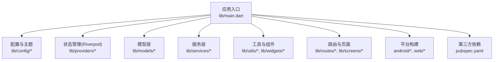
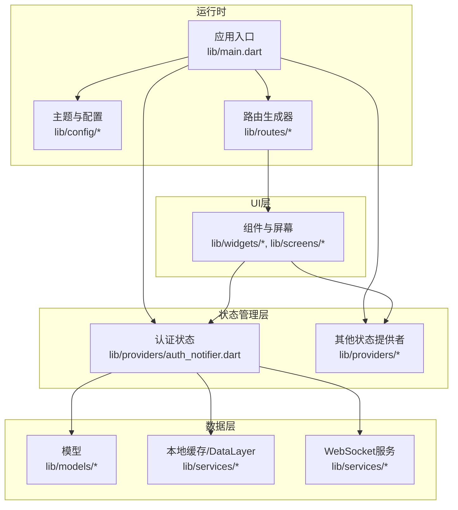
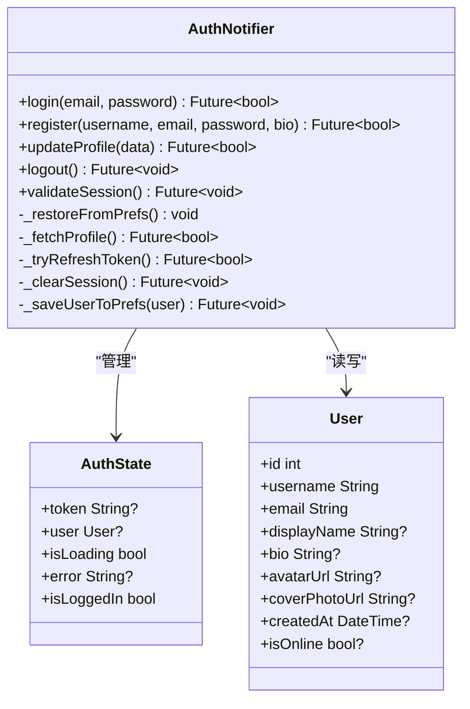
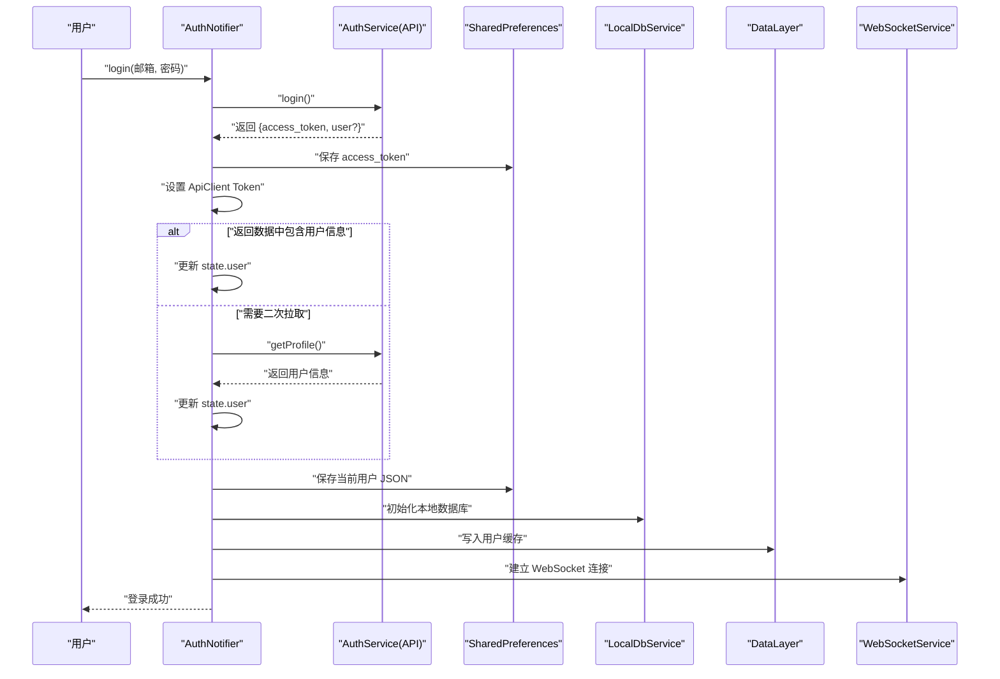
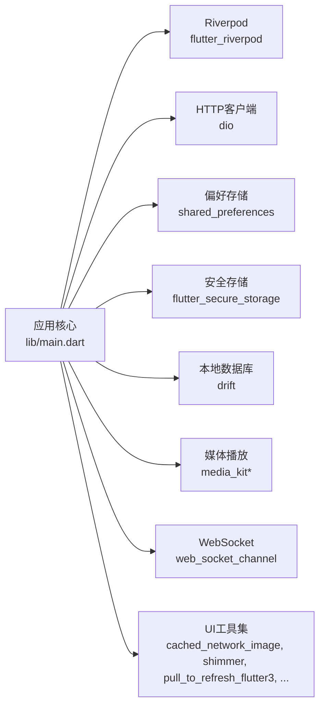

# 项目介绍

<cite>
**本文档引用的文件**
- [README.md](file://README.md)
- [pubspec.yaml](file://pubspec.yaml)
- [lib/main.dart](file://lib/main.dart)
- [lib/config/app_config.dart](file://lib/config/app_config.dart)
- [lib/config/app_theme.dart](file://lib/config/app_theme.dart)
- [lib/providers/auth_notifier.dart](file://lib/providers/auth_notifier.dart)
- [lib/models/post.dart](file://lib/models/post.dart)
- [lib/models/user.dart](file://lib/models/user.dart)
</cite>

## 目录
1. [引言](#引言)
2. [项目结构](#项目结构)
3. [核心组件](#核心组件)
4. [架构总览](#架构总览)
5. [详细组件分析](#详细组件分析)
6. [依赖分析](#依赖分析)
7. [性能考虑](#性能考虑)
8. [故障排除指南](#故障排除指南)
9. [结论](#结论)
10. [附录](#附录)

## 引言
本项目是一个基于 Flutter 框架开发的跨平台社交媒体应用，旨在模拟 Facebook 社交网络的核心功能。它通过统一的 UI 主题、状态管理与数据层设计，为用户提供接近真实社交体验的移动端与 Web 端应用。项目名称为“nonto - 南图，发现世界的动态”，体现了其作为信息与动态分享平台的定位。

项目的主要目标与价值定位如下：
- 跨平台一致性：通过 Flutter 实现一套代码适配 Android、iOS、Web 等多端，降低维护成本并提升发布效率。
- 社交功能闭环：覆盖用户认证、动态流、个人资料管理、实时通信等核心模块，形成完整的社交体验。
- 开发者友好：采用 Riverpod 状态管理、Drift 数据持久化、WebSocket 实时通信等成熟技术栈，便于扩展与维护。
- 初学者友好：提供清晰的目录结构与模块划分，帮助初学者快速理解项目架构与业务流程。

应用场景与价值：
- 移动端与 Web 端同步使用：支持社交动态浏览、发布、互动与消息沟通。
- 多媒体内容支持：支持图片、视频与富文本内容的展示与交互。
- 实时通信：通过 WebSocket 提供好友在线状态、消息推送与互动通知。
- 离线体验优化：结合本地数据库与缓存策略，提升弱网环境下的用户体验。

版本信息与许可证：
- 版本：1.0.0+1（语义化版本，包含构建号）
- 许可证：私有包（未发布至 pub.dev），默认遵循 Flutter 默认许可条款
- SDK 要求：Dart >=3.0.0 <4.0.0

## 项目结构
项目采用按功能域分层的组织方式，核心目录与职责如下：
- lib/main.dart：应用入口，负责全局错误处理、媒体初始化、主题配置与路由生成。
- lib/config：应用配置与主题常量，统一颜色与样式规范。
- lib/providers：状态管理（Riverpod），包含认证、动态流、评论等状态提供者。
- lib/models：数据模型（用户、帖子、消息、通知等）。
- lib/services：服务层（API 客户端、WebSocket、本地存储、音效等）。
- lib/utils：工具类与通用逻辑。
- lib/widgets：可复用 UI 组件。
- lib/screens：页面级组件（导航与页面容器由路由生成器控制）。
- lib/routes：路由定义与路由生成器。
- android、web：平台特定资源与构建配置。
- packages/reliable_websocket：自研可靠 WebSocket 封装包。

图表来源
- [lib/main.dart:17-72](file://lib/main.dart#L17-L72)
- [pubspec.yaml:30-62](file://pubspec.yaml#L30-L62)

章节来源
- [lib/main.dart:17-72](file://lib/main.dart#L17-L72)
- [pubspec.yaml:19](file://pubspec.yaml#L19)
- [pubspec.yaml:21-22](file://pubspec.yaml#L21-L22)

## 核心组件
本节从功能角度概述项目的关键模块及其职责与协作关系。

- 应用入口与全局配置
  - 全局错误处理与 Web 加载遮罩管理，确保异常时用户可见错误而非卡死的加载界面。
  - 媒体初始化与 Web 平台兼容处理，避免在不支持的平台上阻塞启动。
  - SharedPreferences 初始化与重试机制，保障 Web 端 localStorage 的可用性。
  - 主题配置：明暗两套主题，Material3 使用，统一颜色与控件样式。

- 应用配置与主题
  - 全局常量：应用版本、API 基础地址、WebSocket 地址、分页大小、文件大小限制、媒体格式支持等。
  - 主题常量：主色、文本色、边框色、背景色与功能色，保证视觉一致性。
  - AppBar 主题：标题样式、阴影与滚动行为配置。

- 认证与用户状态
  - 三阶段认证流程：同步恢复、后台校验、标准登录/注册/更新/登出。
  - Token 管理：本地持久化、刷新与失效清理。
  - 用户信息缓存：本地数据库初始化、DataLayer 写入与预热。
  - WebSocket 连接：登录后建立连接，登出或失效时断开。

- 数据模型
  - 用户模型：包含基础信息、头像、封面、在线状态与时间戳。
  - 帖子模型：内容、多媒体、可见性、互动计数、话题标签与作者信息。

章节来源
- [lib/main.dart:17-72](file://lib/main.dart#L17-L72)
- [lib/config/app_config.dart:12-63](file://lib/config/app_config.dart#L12-L63)
- [lib/config/app_theme.dart:3-51](file://lib/config/app_theme.dart#L3-L51)
- [lib/providers/auth_notifier.dart:15-377](file://lib/providers/auth_notifier.dart#L15-L377)
- [lib/models/user.dart:1-78](file://lib/models/user.dart#L1-L78)
- [lib/models/post.dart:1-111](file://lib/models/post.dart#L1-L111)

## 架构总览
下图展示了应用的整体架构：入口负责初始化与全局配置；状态管理协调认证与页面状态；模型层承载数据契约；服务层封装网络、存储与实时通信；UI 层通过路由与组件实现页面与交互。

图表来源
- [lib/main.dart:74-234](file://lib/main.dart#L74-L234)
- [lib/providers/auth_notifier.dart:21-377](file://lib/providers/auth_notifier.dart#L21-L377)
- [lib/config/app_config.dart:12-63](file://lib/config/app_config.dart#L12-L63)

## 详细组件分析

### 认证与会话管理（AuthNotifier）
该组件实现了 Facebook 克隆应用的用户认证与会话生命周期管理，采用三阶段设计以兼顾首屏速度与健壮性：
- 同步恢复：从本地偏好中读取 Token 与用户缓存，立即设置初始状态，确保首页无需等待即可显示正确状态。
- 后台校验：在无网络阻塞的情况下拉取用户资料并尝试刷新 Token，维持长期有效会话。
- 标准操作：登录、注册、更新资料与登出，均进行本地持久化、数据库初始化与 WebSocket 连接/断开。

图表来源
- [lib/providers/auth_notifier.dart:21-377](file://lib/providers/auth_notifier.dart#L21-L377)
- [lib/models/user.dart:1-78](file://lib/models/user.dart#L1-L78)

图表来源
- [lib/providers/auth_notifier.dart:213-259](file://lib/providers/auth_notifier.dart#L213-L259)
- [lib/providers/auth_notifier.dart:140-164](file://lib/providers/auth_notifier.dart#L140-L164)
- [lib/providers/auth_notifier.dart:166-191](file://lib/providers/auth_notifier.dart#L166-L191)

章节来源
- [lib/providers/auth_notifier.dart:15-377](file://lib/providers/auth_notifier.dart#L15-L377)

### 应用配置与主题
- 应用配置（AppConfig）集中管理版本、API 地址、WebSocket 地址、分页参数、文件大小与媒体格式等全局常量，便于统一维护与替换。
- 主题配置（AppTheme/AppColors）提供明暗两套主题，统一颜色体系与控件样式，确保 UI 一致性。

章节来源
- [lib/config/app_config.dart:12-63](file://lib/config/app_config.dart#L12-L63)
- [lib/config/app_theme.dart:3-51](file://lib/config/app_theme.dart#L3-L51)

### 数据模型（用户与帖子）
- 用户模型（User）包含标识、账号、邮箱、昵称、简介、头像、封面、在线状态与创建时间等字段，并提供 JSON 序列化/反序列化与拷贝方法。
- 帖子模型（Post）包含内容、视频、缩略图、类型、可见性、互动计数、话题标签、作者信息与时间戳等字段，支持图片/视频媒体判断与 JSON 转换。

章节来源
- [lib/models/user.dart:1-78](file://lib/models/user.dart#L1-L78)
- [lib/models/post.dart:1-111](file://lib/models/post.dart#L1-L111)

## 依赖分析
项目依赖采用按功能拆分的策略，核心依赖包括：
- 状态管理：flutter_riverpod，提供高效的状态共享与响应式更新。
- 网络与存储：dio（HTTP 客户端）、shared_preferences（本地偏好）、flutter_secure_storage（安全存储）、drift（本地数据库）。
- 媒体与播放：media_kit 及相关插件，支持视频播放与跨平台兼容。
- 实时通信：web_socket_channel（WebSocket 客户端），配合自研可靠 WebSocket 包。
- UI 与工具：cached_network_image、photo_view、pull_to_refresh_flutter3、shimmer、intl、video_player、video_thumbnail、video_compress 等。

图表来源
- [pubspec.yaml:30-62](file://pubspec.yaml#L30-L62)
- [lib/main.dart:13-15](file://lib/main.dart#L13-L15)

章节来源
- [pubspec.yaml:30-82](file://pubspec.yaml#L30-L82)

## 性能考虑
- 启动阶段优化
  - 同步恢复认证状态，避免首屏等待；后台执行数据库初始化与缓存写入，减少阻塞。
  - Web 端对媒体初始化进行容错处理，避免因平台差异导致启动失败。
- 网络与缓存
  - 通过 DataLayer 与本地数据库组合，减少重复请求；登录后预热会话数据，提升后续交互速度。
- 媒体处理
  - 视频压缩与缩略图提取，降低上传体积与渲染开销；视频播放器池限制并发数量，控制内存占用。
- UI 体验
  - 明暗主题切换流畅；加载与刷新组件提供良好反馈；图片懒加载与占位动画提升感知性能。

## 故障排除指南
- Web 端启动卡住
  - 现象：HTML 加载遮罩一直显示。
  - 排查：检查全局错误处理器是否触发；确认 SharedPreferences 初始化是否抛出异常并重试。
  - 处理：确保在 main 中调用隐藏加载遮罩函数；检查浏览器 localStorage 权限。
  
- 登录后无法进入主页
  - 现象：登录成功但停留在登录页。
  - 排查：确认 access_token 是否保存；检查用户信息是否成功写入偏好与本地数据库。
  - 处理：验证 AuthService 返回结构；确保 WebSocket 连接已建立。
  
- WebSocket 不生效
  - 现象：消息与通知不更新。
  - 排查：确认 WebSocket 地址与后端连通性；检查连接建立与断开逻辑。
  - 处理：在登录后主动 connect，在登出或失效时 disconnect。

章节来源
- [lib/main.dart:17-72](file://lib/main.dart#L17-L72)
- [lib/providers/auth_notifier.dart:193-202](file://lib/providers/auth_notifier.dart#L193-L202)

## 结论
本项目以 Flutter 为基础，结合 Riverpod、Drift 与 WebSocket 等技术，构建了具备认证、动态流、个人资料与实时通信能力的跨平台社交应用原型。通过模块化的目录结构与清晰的职责划分，既满足初学者的学习需求，也为进一步扩展功能提供了良好的基础。建议在后续迭代中完善路由与页面层、补充测试用例与文档，并根据实际后端接口调整配置与模型映射。

## 附录
- 快速开始
  - 安装依赖：flutter pub get
  - 运行应用：flutter run 或 flutter run -d chrome（Web）
- 版本与许可
  - 版本：1.0.0+1
  - 许可证：私有包（未发布至 pub.dev）