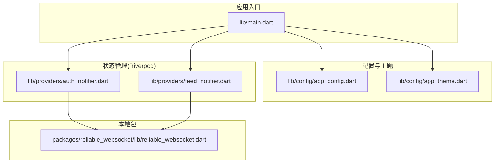
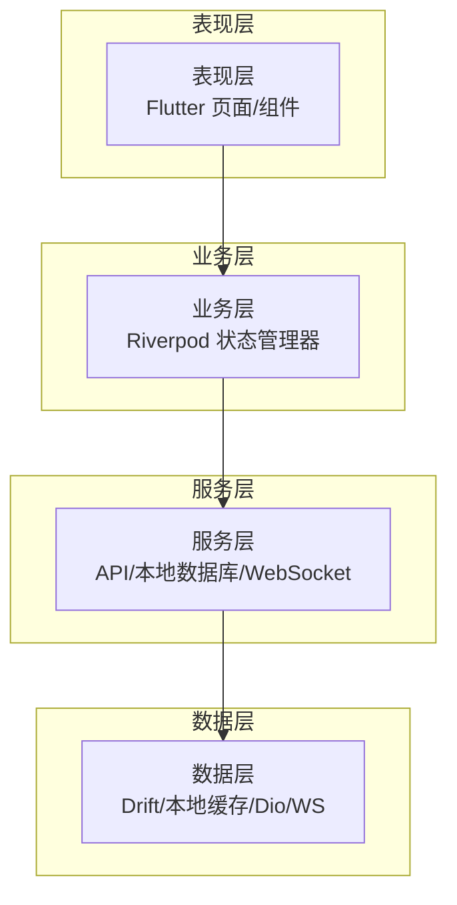
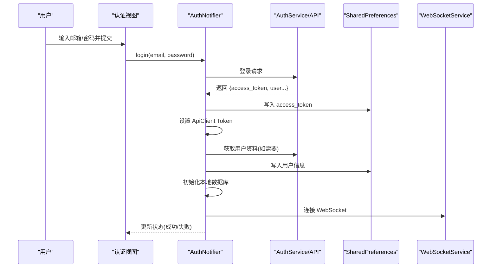
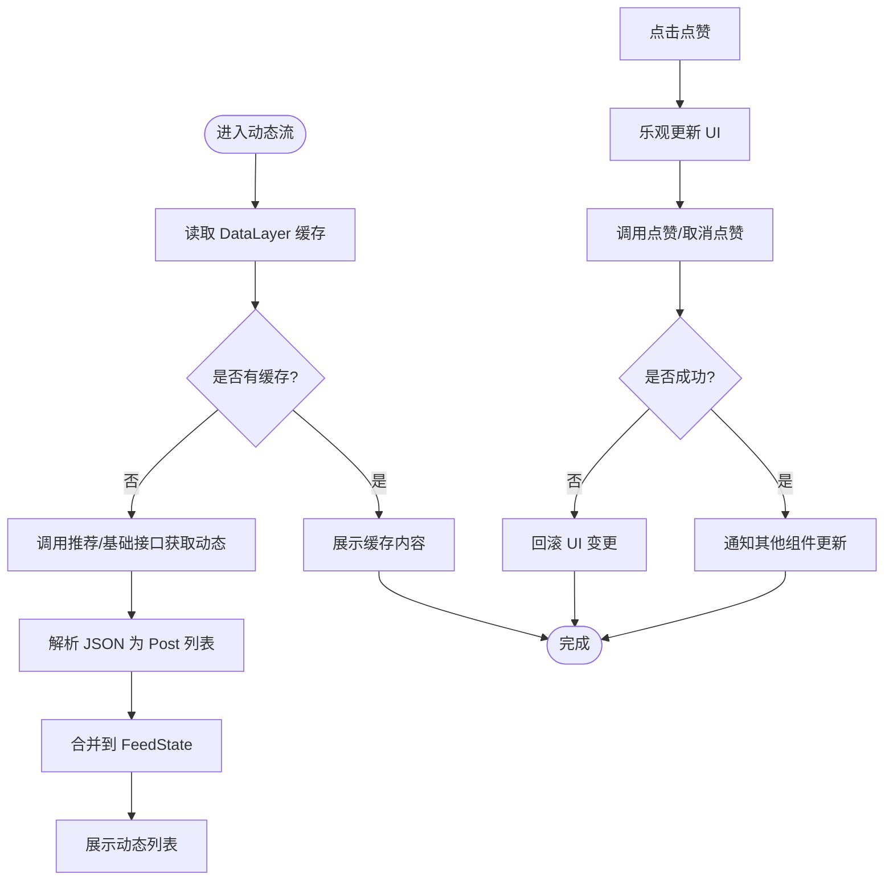
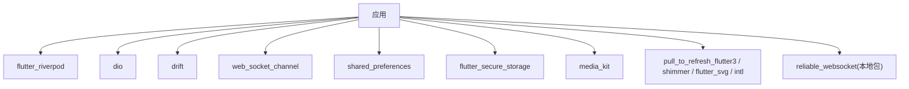

# 项目概述

<cite>
**本文档引用的文件**
- [README.md](file://README.md)
- [pubspec.yaml](file://pubspec.yaml)
- [lib/main.dart](file://lib/main.dart)
- [lib/config/app_config.dart](file://lib/config/app_config.dart)
- [lib/config/app_theme.dart](file://lib/config/app_theme.dart)
- [lib/providers/auth_notifier.dart](file://lib/providers/auth_notifier.dart)
- [lib/providers/feed_notifier.dart](file://lib/providers/feed_notifier.dart)
- [packages/reliable_websocket/lib/reliable_websocket.dart](file://packages/reliable_websocket/lib/reliable_websocket.dart)
</cite>

## 目录
1. [引言](#引言)
2. [项目结构](#项目结构)
3. [核心组件](#核心组件)
4. [架构总览](#架构总览)
5. [详细组件分析](#详细组件分析)
6. [依赖关系分析](#依赖关系分析)
7. [性能考虑](#性能考虑)
8. [故障排除指南](#故障排除指南)
9. [结论](#结论)
10. [附录](#附录)

## 引言
本项目是一个基于 Flutter 的跨平台社交媒体应用，目标是实现 Facebook 社交网络的核心功能，包括用户认证、动态流、实时通信、媒体播放与缓存、离线数据层等。项目采用现代化的前端架构，结合 Riverpod 状态管理、Dio HTTP 客户端、Drift 数据库、WebSocket 实时通信以及本地存储方案，构建高性能、可扩展且跨平台的应用体验。

该应用支持 Android、iOS、Web 和桌面平台，具备深浅主题切换、沉浸式媒体播放、分页加载、点赞交互、消息与通知等典型社交功能。对于初学者，本项目提供了清晰的模块划分与状态管理模式；对于有经验的开发者，项目展示了多层架构、数据层抽象、错误处理与性能优化策略。

## 项目结构
项目采用按功能域划分的目录结构，核心模块包括：
- config：全局配置与主题常量
- providers：Riverpod 状态管理（认证、动态流、评论等）
- models：数据模型（用户、帖子、消息、通知等）
- routes：路由定义与生成器
- screens：页面组件（未在当前快照中列出）
- services：服务层（API、WebSocket、本地数据库、工具类）
- utils：通用工具
- widgets：可复用 UI 组件
- packages：本地包（如可靠 WebSocket）

**图表来源**
- [lib/main.dart:17-72](file://lib/main.dart#L17-L72)
- [lib/config/app_config.dart:13-63](file://lib/config/app_config.dart#L13-L63)
- [lib/config/app_theme.dart:4-51](file://lib/config/app_theme.dart#L4-L51)
- [lib/providers/auth_notifier.dart:21-377](file://lib/providers/auth_notifier.dart#L21-L377)
- [lib/providers/feed_notifier.dart:47-241](file://lib/providers/feed_notifier.dart#L47-L241)
- [packages/reliable_websocket/lib/reliable_websocket.dart](file://packages/reliable_websocket/lib/reliable_websocket.dart)

**章节来源**
- [lib/main.dart:74-234](file://lib/main.dart#L74-L234)
- [pubspec.yaml:1-135](file://pubspec.yaml#L1-L135)

## 核心组件
- 应用入口与全局初始化
  - 在应用启动时设置全局错误处理器、初始化媒体播放器、处理 Web 端加载遮罩、确保本地存储可用，并通过 ProviderScope 注入共享依赖。
- 全局配置与主题
  - 统一的颜色常量、文本与边框样式、深浅主题配置，确保 UI 设计一致性。
- 认证与会话管理
  - 使用 Riverpod 管理认证状态，支持从本地存储恢复会话、后台校验令牌、刷新令牌、登出清理等流程。
- 动态流与分页
  - 提供动态流的状态管理，支持下拉刷新、上拉加载、缓存同步、点赞乐观更新与回滚。
- 实时通信
  - 通过可靠的 WebSocket 连接实现消息与通知的实时推送，支持断线重连与连接生命周期管理。

**章节来源**
- [lib/main.dart:17-72](file://lib/main.dart#L17-L72)
- [lib/config/app_theme.dart:4-51](file://lib/config/app_theme.dart#L4-L51)
- [lib/providers/auth_notifier.dart:21-377](file://lib/providers/auth_notifier.dart#L21-L377)
- [lib/providers/feed_notifier.dart:47-241](file://lib/providers/feed_notifier.dart#L47-L241)

## 架构总览
应用采用“三层架构”理念：
- 表现层：Flutter 页面与组件，使用 Riverpod 订阅状态。
- 业务层：状态管理器（StateNotifier）封装业务逻辑，协调服务层与数据层。
- 数据层：本地数据库（Drift）、内存缓存（DataLayer）、HTTP 客户端（Dio）、WebSocket 服务。

[此图为概念性架构示意，无需图表来源]

## 详细组件分析

### 认证与会话管理（AuthNotifier）
- 设计要点
  - 三阶段初始化：同步恢复本地会话、后台网络校验、标准登录/注册/退出操作。
  - 本地持久化：使用 SharedPreferences 存储访问令牌与用户信息，避免首次渲染阻塞。
  - 令牌刷新：在网络请求失败或超时时尝试刷新令牌，失败则清理会话。
  - 数据预热：登录后异步初始化本地数据库与缓存，提升后续体验。
- 关键流程（登录）

**图表来源**
- [lib/providers/auth_notifier.dart:213-259](file://lib/providers/auth_notifier.dart#L213-L259)
- [lib/providers/auth_notifier.dart:345-354](file://lib/providers/auth_notifier.dart#L345-L354)

**章节来源**
- [lib/providers/auth_notifier.dart:21-377](file://lib/providers/auth_notifier.dart#L21-L377)

### 动态流与分页（FeedNotifier）
- 设计要点
  - 不可变状态：使用不可变 FeedState 与 copyWith 管理状态变更。
  - 缓存优先：构造函数优先读取 DataLayer 缓存，无缓存时等待预热推送。
  - 降级加载：推荐算法失败时回退到基础动态流接口。
  - 乐观更新：点赞时先更新 UI，再异步同步至服务端，失败时回滚。
- 流程图（加载与点赞）

**图表来源**
- [lib/providers/feed_notifier.dart:63-138](file://lib/providers/feed_notifier.dart#L63-L138)
- [lib/providers/feed_notifier.dart:160-204](file://lib/providers/feed_notifier.dart#L160-L204)

**章节来源**
- [lib/providers/feed_notifier.dart:47-241](file://lib/providers/feed_notifier.dart#L47-L241)

### 全局配置与主题
- 全局配置
  - 包含应用版本、后端 API 基础地址、WebSocket 地址、分页参数、文件大小限制、媒体格式支持、可见性与消息/通知类型枚举等。
- 主题与颜色
  - 统一主色调、文本颜色、边框与背景色，提供明暗主题配置，确保一致的视觉体验。

**章节来源**
- [lib/config/app_config.dart:13-63](file://lib/config/app_config.dart#L13-L63)
- [lib/config/app_theme.dart:4-51](file://lib/config/app_theme.dart#L4-L51)

### 应用入口与初始化
- 初始化流程
  - 设置全局错误处理器，防止 Web 端初始化异常导致加载遮罩卡死。
  - 初始化媒体播放器（Web 端捕获异常并继续）。
  - 初始化本地存储（Web 端从 localStorage 读取，失败时重试）。
  - 通过 ProviderScope 注入 SharedPreferences，运行应用主体。
- 主题与路由
  - 配置明暗主题、Material3、导航栏与按钮样式，使用路由生成器与初始路由。

**章节来源**
- [lib/main.dart:17-72](file://lib/main.dart#L17-L72)
- [lib/main.dart:74-234](file://lib/main.dart#L74-L234)

## 依赖关系分析
- 技术栈
  - Flutter SDK 3+
  - Riverpod：状态管理
  - Dio：HTTP 客户端
  - Drift：本地数据库
  - web_socket_channel：WebSocket 客户端
  - shared_preferences / flutter_secure_storage：本地存储
  - media_kit：跨平台媒体播放
  - pull_to_refresh_flutter3 / shimmer：交互与加载
  - intl / flutter_svg：国际化与矢量图
- 本地包
  - reliable_websocket：自研可靠 WebSocket 封装，便于断线重连与消息确认。

**图表来源**
- [pubspec.yaml:30-74](file://pubspec.yaml#L30-L74)
- [pubspec.yaml:52-54](file://pubspec.yaml#L52-L54)

**章节来源**
- [pubspec.yaml:1-135](file://pubspec.yaml#L1-L135)

## 性能考虑
- 首次渲染优化
  - 认证状态同步恢复，避免网络请求阻塞首屏。
  - 本地存储初始化失败时重试，保证 Web 端可用性。
- 状态与缓存
  - 动态流优先读取缓存，减少网络请求；分页加载与懒加载降低内存占用。
  - DataLayer 写入与监听，确保多组件间状态一致性。
- 媒体与播放
  - 媒体播放器池限制并发数量，避免资源浪费。
  - Web 端媒体初始化异常捕获，保证应用继续运行。
- 网络与实时通信
  - WebSocket 断线重连与连接生命周期管理，保障消息可达性。
  - HTTP 请求超时控制与降级策略，提升稳定性。

[本节为通用性能建议，无需章节来源]

## 故障排除指南
- Web 端初始化异常
  - 现象：HTML 加载遮罩卡死。
  - 处理：设置全局错误处理器并在异常时隐藏遮罩，确保用户看到错误界面而非冻结动画。
- 本地存储初始化失败
  - 现象：应用启动时无法读取本地存储。
  - 处理：捕获异常并重试一次，部分浏览器需要事件循环 tick。
- 媒体播放器初始化失败
  - 现象：Web 端无法初始化原生媒体播放器。
  - 处理：捕获异常并继续运行，避免影响其他功能。
- 认证会话失效
  - 现象：网络请求返回未授权。
  - 处理：尝试刷新令牌，失败则清理会话并返回登录页。
- 动态流加载失败
  - 现象：推荐接口失败导致空白页。
  - 处理：自动回退到基础动态流接口；若仍失败，显示错误提示。

**章节来源**
- [lib/main.dart:20-32](file://lib/main.dart#L20-L32)
- [lib/main.dart:48-59](file://lib/main.dart#L48-L59)
- [lib/providers/auth_notifier.dart:88-113](file://lib/providers/auth_notifier.dart#L88-L113)
- [lib/providers/feed_notifier.dart:78-138](file://lib/providers/feed_notifier.dart#L78-L138)

## 结论
本项目以 Flutter 为核心，结合 Riverpod、Dio、Drift、WebSocket 等技术栈，构建了具备现代社交应用特征的跨平台应用。通过明确的模块划分、状态管理与数据层抽象，项目在可维护性、可扩展性与用户体验方面均具备良好基础。对于初学者，项目提供了清晰的架构范式与最佳实践参考；对于有经验的开发者，项目展示了多层架构、实时通信、缓存策略与性能优化的综合实现。

[本节为总结性内容，无需章节来源]

## 附录

### 开发环境要求
- Flutter SDK：3.0.0 至 4.0.0
- 支持平台：Android、iOS、Web、Windows、macOS、Linux
- 推荐 IDE：Android Studio 或 VS Code（配合 Flutter 插件）

**章节来源**
- [pubspec.yaml:21-22](file://pubspec.yaml#L21-L22)

### 快速开始
- 克隆仓库并安装依赖
  - 使用 Flutter CLI 安装依赖与生成代码
- 配置后端与 WebSocket
  - 在全局配置中设置 API 基础地址与 WebSocket 地址
- 运行应用
  - 在目标平台运行应用，Web 端注意本地存储与媒体初始化的兼容性

**章节来源**
- [README.md:5-17](file://README.md#L5-L17)
- [lib/config/app_config.dart:17-21](file://lib/config/app_config.dart#L17-L21)